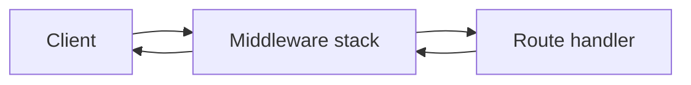

import { Aside, CardGrid, LinkCard, Steps } from '@astrojs/starlight/components';
import MiddlewareInboundStack from '@components/diagrams/MiddlewareInboundStack.astro';
import SectionOutcomes from '@components/SectionOutcomes.astro';

Every request Cadence receives passes through the same fixed sequence: an outermost error handler catches anything that escapes, authentication validates the credential, the tenant layer resolves who the caller is acting for, rate limiting enforces quotas, and finally the route handler does the actual work. Understanding that sequence tells you exactly where to look when something goes wrong.

## Summary for stakeholders

A single Cadence API process serves all organizations. Isolation is enforced by the middleware layers — not by separate deployments — so the health of the shared infrastructure determines what every tenant experiences.

- **Single deploy, many tenants** — Isolation is enforced after authentication in tenant and permission layers (see [Multi-tenancy](/features/multi-tenancy/)).
- **Operational leverage** — Health and behavior depend on **PostgreSQL**, **Redis** (sessions and rate limiting), and optionally **RabbitMQ** for orchestrator messaging and **S3/MinIO** for plugin storage. Gaps in those dependencies surface as structured errors or degraded features — not silent data mixing.
- **Risk posture** — Middleware order is fixed in code. Changes to infrastructure or config alter _when_ failures appear (for example, before or after rate limiting), which matters when triaging incidents.

## Business analysis

When a request fails, the failure comes from a specific layer. A missing or invalid credential is a **401** from the authentication middleware; a valid credential without the right permission is a **403** from route-level authorization; too many requests is a rate-limit response from the Redis-backed sliding window. Knowing which layer produced which status code is what makes runbooks accurate.

- **Single source for "what runs first"** — Product and operations can reference this page instead of ad-hoc diagrams when writing prerequisites ("Redis required for interactive JWT sessions and rate limits").
- **Observable outcomes** — Missing or invalid credentials (**401**), known user but disallowed org or role (**403**), and rate limiting (**429**) are separate acceptance themes corresponding to different middleware layers.

<SectionOutcomes
  outcomes={{
    stakeholder: [
      'Frame incidents using infra dependencies (DB, Redis, broker) without reading Python modules.',
    ],
    'business-analyst': [
      'Write acceptance criteria that reference middleware-visible outcomes and environment prerequisites.',
    ],
  }}
/>

## Architecture and integration

### Request flow



A request enters the outermost middleware first, passes through each layer inward to the route handler, and the response travels back out through the same layers in reverse. Each middleware can short-circuit the chain by returning a response before the request reaches deeper layers.

### Inbound stack

<MiddlewareInboundStack />

### Middleware chain

Starlette runs middleware in reverse registration order: the **last** `add_middleware` call wraps the others and runs **first** on each incoming request. In `cadence.main`, the calls are:

```python title="cadence/main.py — registration order (inner → outer)"
configure_cors_middleware(app, cors_origins)           # innermost
configure_security_headers_middleware(app, settings)
configure_rate_limiting_middleware(app)
configure_tenant_context_middleware(app, settings)
configure_authentication_middleware(app, settings)
configure_error_handlers_middleware(app, settings)    # outermost
```

So the **inbound order** (first to see the request) is:

| Layer                | Class                       | Why it's here                                                                                                                                                                                                                                                       |
| -------------------- | --------------------------- | ------------------------------------------------------------------------------------------------------------------------------------------------------------------------------------------------------------------------------------------------------------------- |
| **Error handling**   | `ErrorHandlerMiddleware`    | Outermost so it catches exceptions from every other layer. Attaches `X-Request-ID`, serializes unhandled exceptions to JSON, avoids double-send on already-started responses.                                                                                       |
| **Authentication**   | `AuthenticationMiddleware`  | Runs before tenant resolution. Checks a public-path allowlist; validates `Authorization: Bearer` (JWT) or `X-API-KEY`; sets `request.state.api_key_row` when a key is used. Without this running first, the tenant layer would try to build a session from nothing. |
| **Tenant context**   | `TenantContextMiddleware`   | Loads `TokenSession` from Redis using the JWT `jti`, or synthesizes one from the API key row. Must run after authentication so the credential is already on `request.state`.                                                                                        |
| **Rate limiting**    | `RateLimitMiddleware`       | Redis sliding-window per org/user/IP. Runs after tenant context so it can read the resolved org tier. If Redis is unavailable, the middleware skips enforcement silently.                                                                                           |
| **Security headers** | `SecurityHeadersMiddleware` | Adds `X-Content-Type-Options: nosniff`, `X-Frame-Options: DENY`, `Referrer-Policy`, `Permissions-Policy`, and HSTS when `CADENCE_ENVIRONMENT=production`. Applied on the way out (response headers).                                                                |
| **CORS**             | `CORSMiddleware`            | Innermost, closest to the route. Validates `Origin` against `CADENCE_CORS_ORIGINS` and handles preflight. Must be registered first so it becomes the innermost wrapper.                                                                                             |

<Aside type="caution" title="CORS and empty origins">
  If `CADENCE_CORS_ORIGINS` is unset, `main.py` logs a warning and cross-origin browser requests
  will be rejected.
</Aside>

<SectionOutcomes
  outcomes={{
    'solution-architect': [
      'Explain inbound versus registration order to integrators and align deployment diagrams with the live stack.',
    ],
    developer: [
      'Name each middleware class in inbound order and relate it to cadence.main registration.',
    ],
  }}
/>

## Implementation notes

### Application entry

`cadence.main` builds a `FastAPI` app, registers middleware, and mounts all routers. The `lifespan=create_lifespan_handler(app_settings)` argument means no request is accepted until the full startup sequence completes.

### Lifespan: startup and shutdown

`create_lifespan_handler` in `cadence.core.lifespan` runs the following sequence before the server accepts any traffic:

<Steps>

    1. **Config validation** — `settings.validate_production_config()`. In production, any insecure setting raises immediately and the process exits rather than starting with known vulnerabilities.

    2. **PostgreSQL + Redis** — `initialize_database_clients` connects both pools and attaches clients to `app.state`. Everything after this point can read from the database.

    3. **Repositories and services** — `_create_repositories` builds all Postgres repos, `SessionStoreRepository` (Redis), `MessageRepository`, and `PluginStoreRepository` (local filesystem, with optional S3/MinIO backend). `SettingsService` bootstraps `global_settings` keys (token TTLs, OAuth flags) if missing.

    4. **RBAC** — `BuiltInRBACProvider` wired with role repos and the Redis client for permission caching.

    5. **Telemetry** — OpenTelemetry providers initialized from DB settings; FastAPI, SQLAlchemy, and Redis instrumentation activated.

    6. **Application services** — `TenantService`, `AuthService`, `OAuthService`, `ConversationService`, `PluginService`, `CentralPointService` constructed and attached to `app.state`.

    7. **Orchestrator pool** — `OrchestratorPool` and `OrchestratorFactory` created; `OrchestratorService` wired together.

    8. **RabbitMQ (optional)** — If `RabbitMQClient.connect()` succeeds: event publisher and consumer for orchestrator lifecycle events start. On failure, the server logs a warning and continues with `app.state.rabbitmq_client = None`.

    9. **Plugin sync** — `ensure_all_catalog_plugins_local` pulls catalog plugin ZIPs from S3 to local cache when object storage is configured.

    10. **Hot tier load** — `load_hot_tier_instances` loads every active `hot`-tier orchestrator into the pool. LLM instrumentors activate for the frameworks in use.

</Steps>

**Shutdown** (after `yield`): event consumer stops, RabbitMQ disconnects, orchestrator pool cleans up, Postgres and Redis disconnect, telemetry shuts down.

### API router registration

`register_api_routers` in `cadence.core.router` mounts routers in this order:

```
health → oauth2 → auth → api_key → chat → orchestrator → engine → plugins → tenant → admin → telemetry → stats
```

Each module owns distinct path prefixes, so registration order has no practical effect on routing — the sequence simply reflects layering by concern (infrastructure → auth → features → admin).

<SectionOutcomes
  outcomes={{
    developer: [
      'Jump from symptom to module: lifespan in core/lifespan.py, routers in core/router.py, middleware in core/middleware_setup.py.',
    ],
  }}
/>

## Verification and quality

- **Rate limiting skips silently without Redis.** If `RateLimitMiddleware` cannot get a Redis client from `app.state`, it passes the request through without enforcing limits. Test the degraded path explicitly.
- **RabbitMQ failure is non-fatal.** Without the broker, orchestrator event messaging is off; the API still serves all other routes.
- **Production startup is strict.** `validate_production_config` will abort startup on insecure config when `CADENCE_ENVIRONMENT=production`. Test the startup sequence in staging before shipping config changes.

<Aside type="note" title="Effective rate limits">
  Rate limits documented in OpenAPI are high-level. Effective limits follow the tier and route rules
  in `RateLimitMiddleware`, configurable via global settings.
</Aside>

<SectionOutcomes
  outcomes={{
    tester: [
      'Design cases for Redis absent versus present, public paths, and tier-based limits using this ordering model.',
    ],
    'solution-architect': [
      'Validate monitoring probes (health vs deep checks) against lifespan dependencies before go-live.',
    ],
  }}
/>

## Next steps

<CardGrid>
  <LinkCard
    title="Security and access"
    href="/concepts/security-and-access/"
    description="JWT, API keys, sessions, and OAuth-related endpoints."
  />
  <LinkCard
    title="Multi-tenancy"
    href="/features/multi-tenancy/"
    description="Organizations, X-ORG-ID, membership, and quotas."
  />
  <LinkCard
    title="Configuration"
    href="/guides/configuration/"
    description="Environment variables and production checklist."
  />
</CardGrid>
