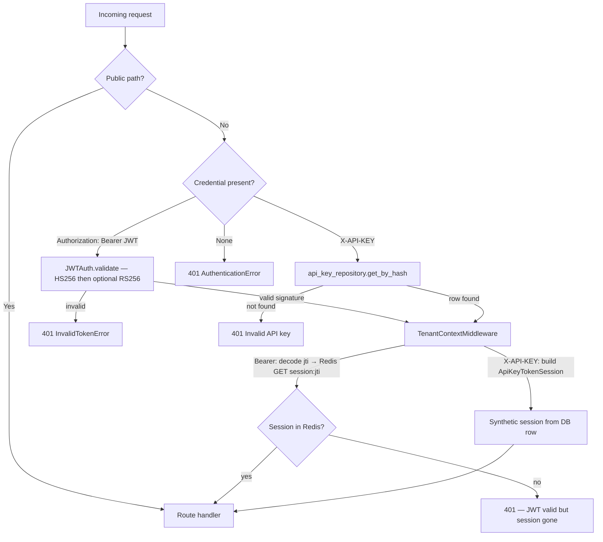

import { Aside, CardGrid, LinkCard } from '@astrojs/starlight/components';
import SectionOutcomes from '@components/SectionOutcomes.astro';

Every protected request in Cadence has to answer three questions before reaching a route handler: **Who are you?** (authentication), **Which organization are you acting for?** (tenant scope), and **Are you allowed to do this?** (authorization). The middleware handles the first two; route-level dependencies handle the third.

## Summary for stakeholders

When a session ends — by logout, by an admin action, or by Redis being cleared — the `jti` row disappears from Redis and every subsequent request using that JWT returns a **401**, even though the JWT's cryptographic signature is still valid. This is the key design property that enables instant revocation.

- **JWT validity ≠ active session** — Cadence always checks Redis for interactive sessions; a signed JWT alone is not enough.
- **API key revocation is immediate** — Deleting or disabling the key row in the database terminates access on the next request.
- **OAuth and social login** — Browser-based flows generate the same JWT + Redis session; the difference is only in how the token was obtained.

## Business analysis

A failed request coming back as **401** is a different problem from a **403**. A **401** means the server does not recognize the caller at all — the credential is missing, invalid, or the session was revoked. A **403** means the server knows who the caller is but they do not have the right permission or membership for that operation. Keeping defects aligned to this distinction matters when writing tickets and acceptance criteria.

- **Observable contracts** — Same endpoint, two different failures: `401` (unknown caller or dead session) versus `403` (known caller, wrong org or permission).
- **OAuth and profiles** — Browser-led flows use OAuth endpoints listed in the API reference below; profile edits go through `/api/me` patterns.

<SectionOutcomes
  outcomes={{
    'business-analyst': [
      'Write acceptance language that distinguishes authentication failures from authorization and tenant scope failures.',
    ],
    stakeholder: [
      'Explain why Redis and key management matter for breach response and session invalidation.',
    ],
  }}
/>

## Architecture overview

The diagram below traces the two credential types from the incoming request through middleware to the route handler.

`JWTAuth.validate` only checks the **cryptographic validity** of the JWT. The live session data — permissions, org memberships — is loaded in `TenantContextMiddleware` from Redis. If there is no `session:{jti}` key in Redis, `request.state.session` remains `None` and any route calling `require_session` returns **401**.

<SectionOutcomes
  outcomes={{
    'solution-architect': [
      'Explain middleware versus route-level enforcement and where Redis and Postgres participate in the trust model.',
    ],
  }}
/>

## Question 1: Who are you?

`AuthenticationMiddleware` runs on every non-public path. It accepts exactly one of two credentials:

**Bearer JWT** — The token is extracted from the `Authorization: Bearer <token>` header. `JWTAuth.validate` first attempts decode with the internal HMAC key (`CADENCE_SECRET_KEY`, default algorithm `HS256`). If that fails and `CADENCE_THIRD_PARTY_JWT_SECRET_KEY` is configured, a second decode is attempted using the third-party algorithm (default `RS256`). If both fail, the middleware raises `InvalidTokenError` and the request returns `401`.

**API key** — The raw key is taken from the `X-API-KEY` header. The middleware hashes it and calls `api_key_repository.get_by_hash`. If the row is not found, the request returns `401 Invalid API key`. If found, the row is placed on `request.state.api_key_row` for downstream use.

There is no fallback between the two. `Authorization: Bearer` is for JWTs only; `X-API-KEY` is for API keys only.

## Question 2: Which organization?

`TenantContextMiddleware` runs immediately after authentication. It resolves which organization the caller is acting for and builds the session object that the rest of the request reads.

**For Bearer JWTs:** the middleware decodes the `jti` claim from the token (using the same HMAC key), then calls `session_store.get_session(jti)` — a Redis `GET session:{jti}`. The result is a `BearerTokenSession` containing the caller's permissions, org memberships, and metadata as they were at login time. If Redis returns nothing, `request.state.session` stays `None` and any route requiring authentication will return `401`.

**For API keys:** the middleware reads `request.state.api_key_row`, fetches the key owner's org memberships from `user_org_membership_repository`, calls `touch_last_used` best-effort, and builds an `ApiKeyTokenSession` in memory. No Redis key is created or read.

**`BearerTokenSession` fields** (stored in Redis, loaded per request):

| Field                       | Type                   | Purpose                                                        |
| --------------------------- | ---------------------- | -------------------------------------------------------------- |
| `jti`                       | `str`                  | Unique session ID; also the Redis key suffix (`session:{jti}`) |
| `user_id`                   | `str`                  | Who the session belongs to                                     |
| `global_permissions`        | `List[str]`            | Platform-wide permissions (sys_admin, system-level ops)        |
| `org_permissions`           | `Dict[str, List[str]]` | Per-org permission lists, keyed by org ID                      |
| `membership_org_ids`        | `List[str]`            | Orgs the user belongs to                                       |
| `org_admin_ids`             | `List[str]`            | Orgs where the user has admin rights                           |
| `client_id`                 | `str \| None`          | OAuth2 client that issued the session                          |
| `auth_method`               | `str`                  | Always `"oauth2"` for interactive JWT sessions                 |
| `created_at` / `expires_at` | `str`                  | ISO timestamps for the session lifetime                        |
| `granted_profile_claims`    | `List[str] \| None`    | OIDC claims consented to during OAuth flow                     |

**`ApiKeyTokenSession` fields** (built in memory, never stored in Redis):

| Field                | Type        | Purpose                                         |
| -------------------- | ----------- | ----------------------------------------------- |
| `jti`                | `str`       | Format: `apikey:{row_id}` — not a Redis key     |
| `user_id`            | `str`       | Key owner                                       |
| `flat_scopes`        | `List[str]` | Permissions after dangerous scopes are stripped |
| `membership_org_ids` | `List[str]` | Orgs the key owner belongs to (loaded from DB)  |
| `org_admin_ids`      | `List[str]` | Orgs where the key owner is admin               |
| `auth_method`        | `str`       | Always `"api_key"`                              |

Route handlers access the resolved context via the `SecurityContext` and `TenantContext` dataclasses. `SecurityContext` is org-agnostic (just `user_id` and `session`). `TenantContext` is org-scoped:

| Field          | Source                                       |
| -------------- | -------------------------------------------- |
| `user_id`      | `session.user_id`                            |
| `org_id`       | `X-ORG-ID` header or path parameter          |
| `is_sys_admin` | Derived from session permissions             |
| `is_org_admin` | `session.is_admin_of(org_id)`                |
| `session`      | `BearerTokenSession` or `ApiKeyTokenSession` |

## Question 3: Are you allowed?

Permission checks are **not** in the middleware. They run in route dependencies. `require_session(request)` raises `AuthenticationError` if `request.state.session` is `None`. Route dependencies like `authenticated` and `roles_allowed(permission)` use the session's `has_permission` method to enforce specific permissions. Org membership is enforced by `org_context` — see [Multi-tenancy](/features/multi-tenancy/) and [Role-based access control](/features/role-based-access-control/).

## Redis session layout

`SessionStoreRepository` manages the following Redis keys for interactive JWT sessions:

| Key pattern                       | Value                              | TTL                                  |
| --------------------------------- | ---------------------------------- | ------------------------------------ |
| `session:{jti}`                   | JSON `BearerTokenSession` payload  | Access token TTL (default 1800 s)    |
| `user_sessions:{user_id}`         | Set of active `jti` values         | Evicted per-entry on logout          |
| `refresh:{refresh_jti}`           | Refresh token row                  | Refresh token TTL (default 604800 s) |
| `user_refresh_sessions:{user_id}` | Set of active refresh `jti` values | Evicted per-entry on revoke          |
| `oauth_state:{state}`             | OAuth2 state artifact              | Short-lived handoff TTL              |
| `oauth2_code:{code}`              | One-time authorization code        | Short-lived, consumed on exchange    |

API key sessions use **none** of these keys.

Token TTLs are runtime settings in the `global_settings` table — not environment variables. Defaults: 1800 s (30 min) for access tokens and 604800 s (7 days) for refresh tokens.

## API reference

| Method   | Path                                | Auth          | Description                                                                              |
| -------- | ----------------------------------- | ------------- | ---------------------------------------------------------------------------------------- |
| `POST`   | `/oauth2/token`                     | Per grant     | Issue access + refresh tokens (`password`, `authorization_code`, `refresh_token` grants) |
| `GET`    | `/.well-known/openid-configuration` | Public        | OIDC discovery document                                                                  |
| `GET`    | `/oauth2/authorize`                 | Public        | Start authorization code flow — redirects to consent UI                                  |
| `GET`    | `/oauth2/consent/context`           | Public        | Decode consent handoff JWT for the consent UI                                            |
| `POST`   | `/oauth2/consent/decision`          | Bearer JWT    | Submit user approval or denial; issues a one-time authorization code                     |
| `GET`    | `/oauth2/userinfo`                  | Bearer JWT    | OIDC profile claims for consented scopes                                                 |
| `POST`   | `/oauth2/revoke`                    | Public (form) | Revoke access or refresh token by value                                                  |
| `POST`   | `/oauth2/introspect`                | Public (form) | Returns `active`, `sub`, `client_id` for a token                                         |
| `DELETE` | `/api/auth/logout`                  | Bearer JWT    | Revoke current session; include `X-Refresh-Token` to also revoke the refresh token       |
| `GET`    | `/api/me`                           | Bearer JWT    | Current user profile                                                                     |
| `PATCH`  | `/api/me/profile`                   | Bearer JWT    | Update profile fields or password                                                        |
| `GET`    | `/api/me/orgs`                      | Bearer JWT    | List caller's org memberships with role                                                  |

`PATCH /api/me/profile` accepts: `display_name`, `email`, `avatar_url`, `locale`, `timezone`, `bio`, `current_password` (required when changing password), `new_password` (min 8 chars).

## Configuration

| Variable                             | Default                  | Purpose                                                                     |
| ------------------------------------ | ------------------------ | --------------------------------------------------------------------------- |
| `CADENCE_SECRET_KEY`                 | (placeholder)            | HMAC key for JWT signing — **must be a strong random value in production**  |
| `CADENCE_JWT_ALGORITHM`              | `HS256`                  | JWT signing algorithm                                                       |
| `CADENCE_THIRD_PARTY_JWT_SECRET_KEY` | —                        | Optional public key for third-party JWT acceptance                          |
| `CADENCE_THIRD_PARTY_JWT_ALGORITHM`  | `RS256`                  | Algorithm for third-party JWTs                                              |
| `CADENCE_ENCRYPTION_KEY`             | (placeholder)            | 64-hex-char AES-256 key for API key storage — **must be set in production** |
| `CADENCE_REDIS_URL`                  | `redis://localhost:6379` | Redis connection for the session store                                      |
| `CADENCE_REDIS_DEFAULT_DB`           | `0`                      | Redis DB index for sessions and OAuth artifacts                             |

<Aside type="danger" title="Production checklist">
  Set `CADENCE_SECRET_KEY` and `CADENCE_ENCRYPTION_KEY` to cryptographically random values before
  going to production. The placeholder defaults are intentionally weak and will cause startup
  warnings.
</Aside>

## Verification and quality

| Symptom                            | Cause                                                               | Fix                                                       |
| ---------------------------------- | ------------------------------------------------------------------- | --------------------------------------------------------- |
| `401 Authentication required`      | No `Authorization` or `X-API-KEY` header on a protected path        | Add `Authorization: Bearer <token>` or `X-API-KEY: <key>` |
| `401 Invalid authentication token` | JWT signature invalid, wrong algorithm, or signed with wrong key    | Verify `CADENCE_SECRET_KEY`; reissue a token              |
| `401 Invalid API key`              | Key hash not found in database (deleted or wrong value)             | Verify key; revoke and re-create if lost                  |
| `401` despite a valid JWT string   | Redis session was deleted (logout, revoke, or admin action)         | Re-authenticate to create a new session                   |
| `403` on org-scoped route          | Caller not a member of the org in `X-ORG-ID`, or missing permission | Verify membership and role; pass the correct `X-ORG-ID`   |
| OAuth redirect loop                | Consent URL or `redirect_uri` misconfigured                         | See [OAuth2 and BFF](/integrations/oauth-bff/)            |
| `422` on profile update            | `new_password` set without `current_password`                       | Include `current_password` whenever changing password     |

<SectionOutcomes
  outcomes={{
    tester: ['Turn the troubleshooting table into repeatable test cases and expected diagnostics.'],
    developer: [
      'Map each symptom to middleware versus handler code paths when debugging production tickets.',
    ],
  }}
/>

## Next steps

<CardGrid>
  <LinkCard
    title="JWT sessions"
    href="/features/jwt-sessions/"
    description="BearerTokenSession, Redis key layout, refresh token rotation, and revocation mechanics."
  />
  <LinkCard
    title="Role-based access control"
    href="/features/role-based-access-control/"
    description="Complete cadence:* permission catalog, built-in roles, and wildcard expansion."
  />
  <LinkCard
    title="OAuth2 and BFF integration"
    href="/integrations/oauth-bff/"
    description="PKCE, consent flow, authorization code exchange, and Nuxt BFF patterns."
  />
  <LinkCard
    title="API keys"
    href="/guides/api-keys/"
    description="cdk_ prefix keys, scope validation, and org-bound automation credentials."
  />
</CardGrid>
