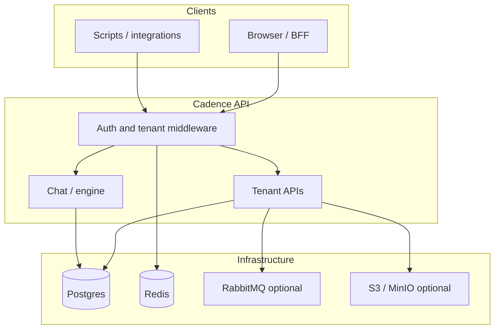

import { CardGrid, LinkCard } from '@astrojs/starlight/components';
import CadencePlatformOverview from '@components/diagrams/CadencePlatformOverview.astro';
import SectionOutcomes from '@components/SectionOutcomes.astro';

**Cadence** is the **backend** for multi-company AI agent setups: organizations, users, configurable AI runtimes ("orchestrator instances"), plugins, and chat-style HTTP APIs — enforced with tenant scope, RBAC, and rate limits.

## Summary for stakeholders

Building AI agents at scale means solving the same operational problems repeatedly: keeping each customer's data separate, letting teams configure their own models and tools without forking the codebase, and providing the controls — quotas, rate limits, observability — that production systems require. Cadence is the shared runtime that handles all of that.

- **One service, many customers** — Organizations share a deployment but **data and settings are isolated** by design; scope is enforced in middleware and services (see [Multi-tenancy](/features/multi-tenancy/)).
- **Composable AI runtimes** — Teams plug in agent frameworks via **orchestrator instances** and **plugins** instead of forking the core for every product line.
- **Operational reality** — Uptime depends on **PostgreSQL**, **Redis**, and optionally **RabbitMQ** and **S3/MinIO**; Redis loss degrades sessions and rate limits — plan capacity accordingly.

## Business analysis

- **Problem space** — Teams need a **production API** that combines **multi-tenancy**, **pluggable agent frameworks**, and **operational controls** (sessions, quotas, observability) without rebuilding that stack per product.
- **Primary capabilities** — Tenant orgs, orchestrator lifecycle, plugin catalog, chat/completion HTTP APIs, RBAC, rate limits — each maps to documented feature pages for acceptance decomposition.

<SectionOutcomes
  outcomes={{
    stakeholder: ['Justify build-vs-buy for a multi-tenant AI platform using this scope summary.'],
    'business-analyst': [
      'Decompose epics along tenancy, orchestration, plugins, and chat surfaces.',
    ],
  }}
/>

## Architecture and integration

### How the pieces fit

<CadencePlatformOverview />

**Cadence** delivers:

- **Multi-tenant organizations** — Each org has isolated data, settings, LLM configs, and orchestrator instances. Scope is carried on requests (paths and headers) and enforced in middleware and domain services.
- **Orchestrator instances** — Configurable agent runtimes (LangGraph, OpenAI Agents SDK, and other supported frameworks) with a **pool** that loads **hot-tier** instances at startup and reacts to lifecycle events.
- **Plugins** — System and tenant plugin catalogs with storage on disk or S3/MinIO, validation, and dependency resolution before orchestrators run.
- **Chat and completion** — HTTP APIs that route to the engine layer and respect org context, rate limits, and quotas.

The service is a **FastAPI** application (API version **2.0.5** in `cadence.main`). Persistent state lives primarily in **PostgreSQL**; **Redis** backs sessions, rate limiting, and stats; **RabbitMQ** drives orchestrator lifecycle events when available; **S3 or MinIO** stores plugin ZIPs when enabled (`CADENCE_S3_ENABLED=true`).

<SectionOutcomes
  outcomes={{
    'solution-architect': [
      'Explain data-plane vs control-plane dependencies using Postgres, Redis, optional RabbitMQ, and optional S3/MinIO.',
    ],
  }}
/>

## Implementation notes

At code level, HTTP routers are registered in **`cadence.core.router.register_api_routers`**; the FastAPI app is built in **`cadence.main`**. Startup wiring — database connections, services, orchestrator pool, optional broker and plugin sync — runs in **`create_lifespan_handler`** in `cadence.core.lifespan`. See [How the platform works](/concepts/how-it-works/) for the full startup sequence.

<SectionOutcomes
  outcomes={{
    developer: [
      'Navigate from this overview to router modules under cadence.api.* and core startup in core/lifespan.py.',
    ],
  }}
/>

## Verification and quality

- **Not a frontend** — Configure `CADENCE_CORS_ORIGINS` for browser clients; the API does not ship a UI.
- **Redis-dependent features** — Sessions and rate limits expect Redis; behavior degrades by design when Redis is unavailable — cover in staging drills.
- **RabbitMQ optional** — Without the broker, orchestrator event messaging is off; the rest of the API runs and logs a warning.
- **S3/MinIO optional** — Without object storage, plugins are kept on the local filesystem only; configure `CADENCE_PLUGIN_S3_ENABLED=true` and credentials to enable distributed storage.

<SectionOutcomes
  outcomes={{
    tester: [
      'Plan smoke coverage across tenancy, auth, chat, and orchestrator flows using this capability map.',
    ],
  }}
/>

## Next steps

<CardGrid>
  <LinkCard
    title="How the platform works"
    href="/concepts/how-it-works/"
    description="Middleware order, lifespan startup, and router registration."
  />
  <LinkCard
    title="Security and access"
    href="/concepts/security-and-access/"
    description="JWT, API keys, sessions, and OAuth-related endpoints."
  />
  <LinkCard
    title="Feature guides"
    href="/features/"
    description="Deep dives by capability — tenancy, RBAC, orchestrators, plugins, chat."
  />
</CardGrid>
