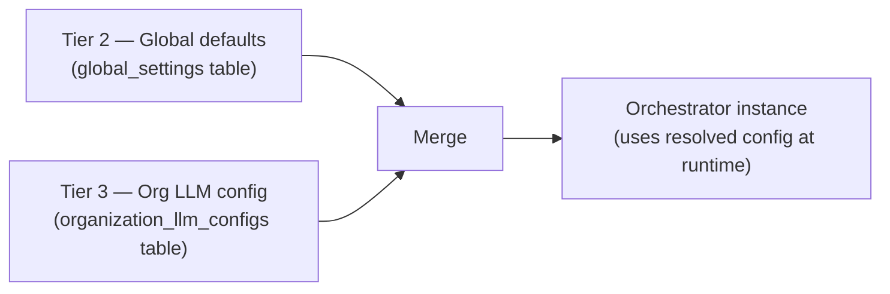

import { Aside, CardGrid, LinkCard } from '@astrojs/starlight/components';

Cadence ships no LLM API keys. Every organization brings its own keys, which the platform stores encrypted and resolves at runtime when an orchestrator needs to call a model. This design — called BYOK (Bring Your Own Key) — means each org pays its own LLM bill and its credentials never touch another tenant's context.

## How the cascade works

When an orchestrator needs to call a model, the platform resolves the configuration through three tiers:

**Tier 2 (Global)** — Platform-wide defaults stored in `global_settings`. These are the fallback values when no org override exists. A platform admin can set these via the admin API without restarting the service.

**Tier 3 (Org LLM config)** — Each organization registers its own LLM configurations with its own API keys. When an orchestrator is assigned an `llm_config_id`, that config is the active provider and key for that instance.

**Instance resolution** — At runtime, `LLMModelFactory.create_model_by_id` in `cadence/infra/llm/factory.py` fetches the org's `OrganizationLLMConfig` by ID, decrypts the API key, validates the provider, and constructs the framework-appropriate model object.

## OrganizationLLMConfig

Each row in `organization_llm_configs` represents one provider + key combination for an org:

| Field               | Type           | Purpose                                                                                    |
| ------------------- | -------------- | ------------------------------------------------------------------------------------------ |
| `id`                | UUID           | Primary key — used as `llm_config_id` in orchestrator references                           |
| `org_id`            | UUID           | Owning organization; enforces tenant isolation                                             |
| `name`              | string         | Label for this config (not unique per org; use `id` for CRUD)                              |
| `provider`          | string         | LLM provider identifier (e.g. `openai`, `anthropic`, `google`)                             |
| `api_key`           | text           | Provider API key — stored encrypted at the service layer                                   |
| `base_url`          | string \| null | Optional custom base URL (for proxies or self-hosted endpoints)                            |
| `additional_config` | JSONB          | Provider-specific extras (e.g. Azure `deployment_id`, `api_version`)                       |
| `is_enabled`        | boolean        | If `false`: hidden from new orchestrator dropdowns; existing orchestrators continue to run |
| `is_deleted`        | boolean        | Soft-delete; cannot soft-delete while referenced by an active orchestrator                 |

<Aside type="caution" title="A config cannot be deleted while in use">
  Soft-deleting an `OrganizationLLMConfig` that is still referenced by an active orchestrator will
  be rejected. Deactivate or update the orchestrator first.
</Aside>

## Provider and framework compatibility

`LLMModelFactory` constructs different model objects depending on the target framework:

| Framework       | Supported providers                         | Notes                                                                        |
| --------------- | ------------------------------------------- | ---------------------------------------------------------------------------- |
| `langgraph`     | All providers                               | Returns a LangChain `BaseChatModel`; supports `temperature` and `max_tokens` |
| `openai_agents` | `openai`, `litellm`, `bifrost`              | Returns an OpenAI Agents SDK model                                           |
| `google_adk`    | `google`, `anthropic`, `litellm`, `bifrost` | Returns a Google ADK model                                                   |

`temperature` and `max_tokens` parameters are only applied when the framework is `langgraph`. For other frameworks, those values are ignored at the factory level (pass them through model-level config instead).

## API reference

| Method   | Path                                  | Permission                      | Description                                                |
| -------- | ------------------------------------- | ------------------------------- | ---------------------------------------------------------- |
| `GET`    | `/api/orgs/{org_id}/llm-configs`      | `cadence:org:llm-configs:read`  | List org LLM configs                                       |
| `POST`   | `/api/orgs/{org_id}/llm-configs`      | `cadence:org:llm-configs:write` | Create a new config with provider + API key                |
| `GET`    | `/api/orgs/{org_id}/llm-configs/{id}` | `cadence:org:llm-configs:read`  | Get one config (API key is not returned)                   |
| `PATCH`  | `/api/orgs/{org_id}/llm-configs/{id}` | `cadence:org:llm-configs:write` | Update provider, key, base_url, additional_config          |
| `DELETE` | `/api/orgs/{org_id}/llm-configs/{id}` | `cadence:org:llm-configs:write` | Soft-delete (blocked if referenced by active orchestrator) |

## BYOK and security

When an org admin creates an LLM config, the raw API key is encrypted by `cadence.infra.security.encryption` before storage. `LLMModelFactory._decrypt_api_key` decrypts it in memory at model construction time. The raw key is never returned via the API after creation.

Custom `base_url` values are validated against a blocklist of cloud metadata endpoints (`169.254.169.254`, `metadata.google.internal`, etc.) to prevent SSRF attacks from malicious provider URLs.

## Related pages

<CardGrid>
  <LinkCard
    title="Orchestration backends"
    href="/features/orchestration-backends/"
    description="Framework selection and provider compatibility matrix."
  />
  <LinkCard
    title="Multi-tenancy"
    href="/features/multi-tenancy/"
    description="Organizations, X-ORG-ID, and quotas."
  />
  <LinkCard
    title="Configuration"
    href="/guides/configuration/"
    description="Environment variables and encryption key setup."
  />
</CardGrid>
