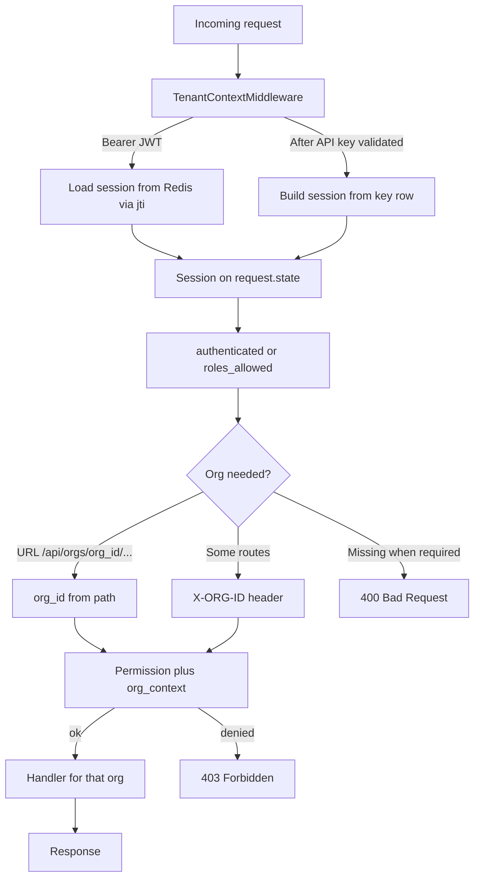

import { Aside, CardGrid, LinkCard, Steps } from '@astrojs/starlight/components';
import SectionOutcomes from '@components/SectionOutcomes.astro';

Many organizations share one Cadence deployment, but their data and orchestrator instances never mix. An organization is both a commercial boundary — quotas, tiers, and LLM configs are scoped per org — and a security boundary: a user who is not a member of an org cannot read or modify anything in it, regardless of what their JWT says.

Every request that touches org-specific data must declare which org it is acting for, either via the `org_id` in the URL path or the **`X-ORG-ID`** header. The platform checks membership and permissions against that org identity before any data is read or written.

## Summary for stakeholders

- **Commercial unit** — Each **organization** is the billable/contractual boundary for quotas (`TierQuota`) and feature limits.
- **Data separation** — Cross-org leakage is blocked by membership checks and permissions, not by separate databases per customer.

## Business analysis

- **Actors** — Org members, org admins, and platform admins (`sys_admin`) see different org lists and capabilities.
- **Rules** — Routes either embed `org_id` in the path or require **`X-ORG-ID`** when the handler needs explicit tenant scope.

<SectionOutcomes
  outcomes={{
    'business-analyst': [
      'Author requirements that cite path versus header org selection and expected errors when they disagree.',
    ],
    tester: [
      'Exercise cases where the caller belongs to multiple orgs and must send the correct X-ORG-ID.',
    ],
  }}
/>

## Architecture overview



`TenantContextMiddleware` runs **after** `AuthenticationMiddleware` on the inbound request (see [How the platform works](/concepts/how-it-works/)). It sets `request.state.session` to a **`BearerTokenSession`** (Redis) or **`ApiKeyTokenSession`** (synthetic). Route handlers use **`Depends(authenticated)`**, **`Depends(roles_allowed(PERM))`**, and **`org_context(security, org_id)`** from shared route helpers to enforce membership and build **`TenantContext`**.

---

## Data model

### Organization

| Field           | Type            | Notes                                                                                                                                                           |
| --------------- | --------------- | --------------------------------------------------------------------------------------------------------------------------------------------------------------- |
| `org_id`        | UUID7           | Primary key                                                                                                                                                     |
| `name`          | string          | Internal short name (set at creation, read-only via org_admin)                                                                                                  |
| `display_name`  | string \| null  | Human-visible name                                                                                                                                              |
| `domain`        | string          | Unique domain slug (read-only for org_admin; sys_admin only)                                                                                                    |
| `tier`          | string          | Subscription tier (e.g. `free`, `starter`); governs quota limits. Stored as `subscription_tier` in the database; the API accepts `tier` and maps it internally. |
| `status`        | string          | `active` or `inactive`; inactive orgs are excluded from user listings                                                                                           |
| `description`   | string \| null  | Free-form description                                                                                                                                           |
| `contact_email` | string \| null  | Validated email                                                                                                                                                 |
| `website`       | string \| null  | URL                                                                                                                                                             |
| `logo_url`      | string \| null  | URL                                                                                                                                                             |
| `country`       | string \| null  | Country code                                                                                                                                                    |
| `timezone`      | string \| null  | IANA timezone                                                                                                                                                   |
| `is_deleted`    | boolean         | Soft delete                                                                                                                                                     |
| `created_at`    | ISO-8601 string | UTC timestamp                                                                                                                                                   |

### UserOrgMembership

| Field      | Type    | Notes                                               |
| ---------- | ------- | --------------------------------------------------- |
| `user_id`  | UUID7   | Foreign key                                         |
| `org_id`   | UUID7   | Foreign key                                         |
| `is_admin` | boolean | Org admin flag — tracked separately from RBAC roles |

### TenantSetting

Key-value store for org-level runtime overrides (stored in the database, broadcast via RabbitMQ
when changed).

| Field         | Type    | Notes                                               |
| ------------- | ------- | --------------------------------------------------- |
| `org_id`      | UUID7   | Owning org                                          |
| `key`         | string  | Setting key (e.g. `max_tokens`, `default_model`)    |
| `value`       | string  | Setting value                                       |
| `overridable` | boolean | Whether lower-tier overrides can replace this value |

### Tier quotas

Quota limits are **not a separate database table**. They are stored as JSONB values in the `global_settings` table under the key `tier.{tier_name}` (for example, `tier.free`, `tier.starter`). When the platform needs to enforce a limit, `QuotaCheckMixin._get_quota_limit` reads the org's `subscription_tier`, looks up `global_settings["tier.{tier_name}"]`, and extracts the relevant field from the JSON dict.

A limit value of `-1` is treated as unlimited and never blocks creation. If no tier definition exists in `global_settings`, the quota check is skipped (fail-open). Platform admins manage tier definitions via the admin settings API.

Common quota fields stored in the tier JSON:

| Field                    | Meaning                                |
| ------------------------ | -------------------------------------- |
| `max_orchestrators`      | Maximum orchestrator instances per org |
| `max_central_points`     | Maximum central point aliases          |
| `max_members`            | Maximum org members                    |
| `max_messages_per_month` | Monthly chat message limit             |
| `max_messages_per_day`   | Daily chat message limit               |
| `rate_limit_rpm`         | API requests per minute                |
| `rate_chat_limit_rpm`    | Chat requests per minute               |
| `rate_limit_burst`       | Burst allowance above the rpm limit    |
| `max_llm_configs`        | Maximum LLM configuration entries      |

## API reference

### Org profile

| Method  | Path                         | Permission          | Description                                                 |
| ------- | ---------------------------- | ------------------- | ----------------------------------------------------------- |
| `GET`   | `/api/orgs`                  | Authenticated       | List accessible orgs (`sys_admin` sees all; others see own) |
| `GET`   | `/api/orgs/{org_id}`         | `cadence:org:read`  | Get org profile                                             |
| `PATCH` | `/api/orgs/{org_id}/profile` | `cadence:org:write` | Update mutable profile fields (org_admin)                   |

`PATCH /api/orgs/{org_id}/profile` accepts only: `display_name`, `description`, `contact_email`,
`website`, `logo_url`, `country`, `timezone`. Fields `name`, `domain`, `tier`, and `status`
are read-only for org admins.

### Admin org management (`cadence:system:*`)

| Method  | Path                             | Permission                   | Description                                  |
| ------- | -------------------------------- | ---------------------------- | -------------------------------------------- |
| `POST`  | `/api/admin/orgs`                | `cadence:system:orgs:create` | Create a new organization                    |
| `GET`   | `/api/admin/orgs`                | `cadence:system:admin`       | List all orgs including deleted              |
| `GET`   | `/api/admin/orgs/{org_id}`       | `cadence:system:admin`       | Get any org by ID                            |
| `PATCH` | `/api/admin/orgs/{org_id}`       | `cadence:system:admin`       | Full org update (name, domain, tier, status) |
| `GET`   | `/api/admin/orgs/{org_id}/quota` | `cadence:system:tiers:read`  | Get tier quota limits for an org             |

### Membership management

| Method   | Path                                            | Permission                  | Description                     |
| -------- | ----------------------------------------------- | --------------------------- | ------------------------------- |
| `GET`    | `/api/orgs/{org_id}/users`                      | `cadence:org:members:read`  | List active org members         |
| `POST`   | `/api/orgs/{org_id}/members`                    | `cadence:org:members:write` | Add an existing user to the org |
| `PATCH`  | `/api/orgs/{org_id}/users/{user_id}/membership` | `cadence:org:members:write` | Toggle admin flag               |
| `DELETE` | `/api/orgs/{org_id}/users/{user_id}`            | `cadence:org:members:write` | Remove a user from the org      |

### Org settings

| Method | Path                                       | Permission                   | Description                   |
| ------ | ------------------------------------------ | ---------------------------- | ----------------------------- |
| `GET`  | `/api/orgs/{org_id}/settings`              | `cadence:org:settings:read`  | List all org-level settings   |
| `POST` | `/api/orgs/{org_id}/settings`              | `cadence:org:settings:write` | Create or update a setting    |
| `GET`  | `/api/orgs/{org_id}/orchestrator-defaults` | `cadence:org:settings:read`  | Get org orchestrator defaults |
| `PUT`  | `/api/orgs/{org_id}/orchestrator-defaults` | `cadence:org:settings:write` | Set org orchestrator defaults |

## How it works — request lifecycle

<Steps>

    1. `AuthenticationMiddleware` validates the JWT signature or hashes the `X-API-KEY` value to
    look up the key row. Invalid credentials are rejected with `401` before any session work.

    2. `TenantContextMiddleware` runs next. For JWTs, it reads `jti` and loads the session from Redis (`session:{jti}`).
    For API keys (after the key row was loaded in the previous middleware), it builds a synthetic session: stable id
    `apikey:{key_row.id}`, scopes from the key (sanitized), and org membership from the user’s memberships in the
    database.

    3. The route declares dependencies such as **`Depends(roles_allowed(PERM))`** or **`Depends(authenticated)`**.
    Handlers that work on a specific org usually call **`org_context(security, org_id)`** so non–system admins must be
    members of that org.

    4. Some endpoints (for example chat completion) read **`X-ORG-ID`** in the handler and call
    **`session.has_permission(..., org_id)`** with that value. The handler then runs services that query only that org’s
    data.

</Steps>

```python title="Tenant context middleware dispatch"
async def dispatch(self, request: Request, call_next):
    request.state.session = None

    api_row = getattr(request.state, "api_key_row", None)
    if api_row is not None:
        session = await self._session_from_api_key(request, api_row)
        request.state.session = session
        request.state.token_jti = session.jti
        return await call_next(request)

    bearer = self._extract_bearer(request)
    if bearer:
        jti = self._decode_jwt_jti(bearer)
        if jti:
            session_store = getattr(request.app.state, "session_store", None)
            if session_store:
                session = await session_store.get_session(jti)
                if session:
                    request.state.session = session
                    request.state.token_jti = jti

    return await call_next(request)
```

## How it works — permission and org context

**Path-scoped org routes** (for example `GET /api/orgs/{org_id}`) use **`Depends(roles_allowed(PERM))`**, which requires a logged-in session and checks that the caller holds the needed permission according to authorization middleware rules.

**Membership in the org:** Many handlers call **`org_context(security, org_id)`** from shared route helpers:

- **System administrators** may act for any org id.
- **Everyone else** must be a member of that org or the API returns **403**.
- The result is a **`TenantContext`** (`user_id`, `org_id`, admin flags, full session) used for the rest of the handler.

**Header-based org:** Endpoints such as **`POST /api/chat/completion`** require **`X-ORG-ID`** and check permissions for that org inside the handler (for example **`CHAT_USE`**).

## How it works — API key session

**`ApiKeyTokenSession`** is built in **`TenantContextMiddleware._session_from_api_key`**: org membership and admin flags come from the database for the key’s user; allowed actions come from the key’s **scopes**, after **`sanitize_api_key_flat_scopes`** removes the highest-risk platform permissions.

When the API checks **`has_permission(permission, org_id)`** for an API-key session, the user must belong to that org **and** the scope list must allow the permission (wildcards are expanded the same way as for interactive users).

## How it works — sys_admin org visibility

`sys_admin` callers bypass org membership checks and can access any org. `GET /api/orgs`
returns all orgs (including soft-deleted) for sys_admin with `role = "sys_admin"`, while
regular users receive only their own memberships with their actual role.

```python title="Organization listing for sys_admin vs regular users"
if security.session.is_sys_admin:
    orgs = await tenant_service.list_orgs(include_deleted=True)
    ...
orgs = await tenant_service.list_orgs_for_user(security.user_id)
```

## UI walkthrough

In the **Nuxt** management app, the **active organization** is stored in a cookie so the client can send **`X-ORG-ID`** on requests that need it (for example chat). Your own frontend should follow the same idea: pick one org per session or screen, then pass it in the header when the API expects it.

```typescript title="ui/app/composables/useAuth.ts"
const currentOrgId = useCookie<string | null>(COOKIE_SESSION_CONTEXT, { default: () => null });

const currentOrg = computed<OrgAccessResponse | null>(() => {
  if (!currentOrgId.value) return null;
  return orgList.value.find((o) => o.org_id === currentOrgId.value) ?? null;
});

function selectOrg(orgId: string): void {
  currentOrgId.value = orgId;
  router.push('/dashboard');
}
```

When a user with `is_sys_admin = true` logs in, `currentOrgId` is set to `null` — admins
work at the system level and must explicitly select an org when needed.

## Verification and quality

### Troubleshooting

| Symptom                                       | Cause                                                                | Fix                                                                                  |
| --------------------------------------------- | -------------------------------------------------------------------- | ------------------------------------------------------------------------------------ |
| `400 Missing organization (header: X-ORG-ID)` | Chat or org-header route called without `X-ORG-ID`                   | Add `X-ORG-ID: <org_id>` to the request                                              |
| `403` on org-scoped action                    | Caller not a member or lacks the required permission in that org     | Verify membership and role; check `GET /api/me/orgs`                                 |
| `404` after correct org_id in path            | Org doesn't exist, or is soft-deleted and the route excludes deleted | Verify org exists via `GET /api/admin/orgs/{org_id}` (sys_admin)                     |
| API key rejected for org                      | Scope or **membership** does not include the target org              | Grant org membership or scopes that cover the operation                              |
| Wrong data after UI org switch                | Cookie still pointing at the old org; cached composable state        | Click the org switcher or call `selectOrg(orgId)` explicitly; clear cookies if stuck |
| `409 Organization domain already exists`      | Domain is already in use                                             | Choose a unique domain value for the new org                                         |
| Org member can't read settings                | Has `org_member` role which lacks `cadence:org:settings:read`        | Assign `org_admin` or a custom role with that permission                             |

<SectionOutcomes
  outcomes={{
    developer: [
      'Debug org_context and API-key scope checks using the permission and membership rules summarized above.',
    ],
    'solution-architect': [
      'Explain why sys_admin bypass differs from regular membership for audit and least-privilege reviews.',
    ],
  }}
/>

## Next steps

<CardGrid>
  <LinkCard
    title="Role-based access control"
    href="/features/role-based-access-control/"
    description="cadence:* permission strings, built-in roles, and API key scope validation."
  />
  <LinkCard
    title="JWT sessions"
    href="/features/jwt-sessions/"
    description="How Redis-backed jti sessions enable immediate revocation."
  />
  <LinkCard
    title="LLM configuration"
    href="/features/llm-configuration/"
    description="Per-org LLM provider settings and the three-tier configuration cascade."
  />
</CardGrid>
