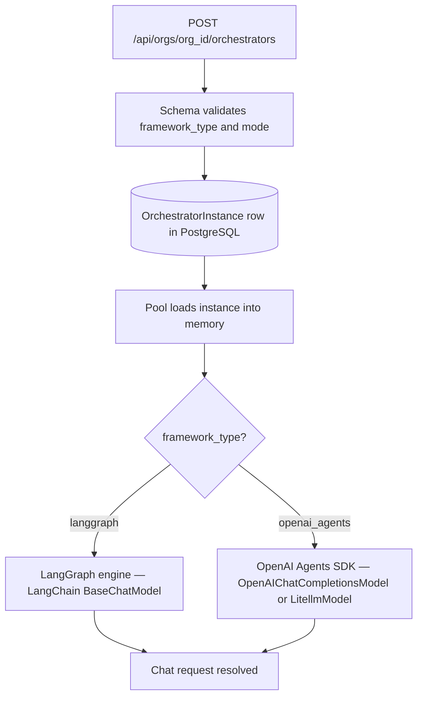

import { Aside, CardGrid, LinkCard, Steps } from '@astrojs/starlight/components';

Choosing a backend means choosing the engine that will execute your agent graph — how tool calls get routed, how agents hand off to each other, and which model providers the framework can talk to. **Production orchestrators** use **`langgraph`** or **`openai_agents`**. The **`google_adk`** value appears in create-request validation patterns for forward compatibility, but **`OrchestratorFactory` does not register `google_adk` backends** — do not use it for new instances until support ships.

The `framework_type` and `mode` fields are frozen at orchestrator creation. Once an instance exists, switching engines means creating a new orchestrator and redirecting any central points that reference the old one.

## How it works

When a chat request arrives, the platform resolves the orchestrator instance from the pool and calls its framework-specific `astream` method. That method uses the resolved LLM config (decrypted BYOK key, provider, base URL) to make model calls through the framework's native SDK — LangChain for LangGraph, the OpenAI Agents SDK for `openai_agents`. Plugins inject tools into the graph at load time, before the first message arrives.



## Framework capabilities

Two backends are active today. Each has its own mode support and provider compatibility:

| Framework       | Supported modes (factory + API validation)              | Provider support (`FRAMEWORK_SUPPORTED_PROVIDERS`)            |
| --------------- | ------------------------------------------------------- | ------------------------------------------------------------- |
| `langgraph`     | `supervisor`, `coordinator`, `handoff`, `grounded`      | All providers listed in `cadence/core/constants/framework.py` |
| `openai_agents` | `supervisor`, `coordinator`, `handoff` (not `grounded`) | `openai`, `litellm`, `bifrost`                                |

`langgraph` uses the LangChain ecosystem and supports stateful graphs with all registered providers. `openai_agents` uses the OpenAI Agents SDK and is limited to providers that implement the OpenAI chat completions interface.

<Aside type="note" title="grounded mode is LangGraph only">
  `grounded` mode enforces scope rules at the router level and is only implemented for `langgraph`.
  Sending `mode: "grounded"` with `framework_type: "openai_agents"` will be rejected at load time
  with a `ConfigurationError`.
</Aside>

### Provider × framework compatibility

```
openai      → langgraph ✓  openai_agents ✓
anthropic   → langgraph ✓  openai_agents ✗
claude      → langgraph ✓  openai_agents ✗
google      → langgraph ✓  openai_agents ✗
gemini      → langgraph ✓  openai_agents ✗
azure       → langgraph ✓  openai_agents ✗
groq        → langgraph ✓  openai_agents ✗
litellm     → langgraph ✓  openai_agents ✓
tensorzero  → langgraph ✓  openai_agents ✗
bifrost     → langgraph ✓  openai_agents ✓
```

Source: `FRAMEWORK_SUPPORTED_PROVIDERS` in `cadence/core/constants/framework.py`. You can query the supported providers for any framework at runtime via `GET /api/frameworks/{framework_type}/supported-providers`. Creating an orchestrator with a mismatched provider and framework will fail at LLM config validation.

## Data model

### OrchestratorInstance

| Field             | Type           | Notes                                                                                   |
| ----------------- | -------------- | --------------------------------------------------------------------------------------- |
| `instance_id`     | UUID7          | Primary key                                                                             |
| `org_id`          | UUID7          | Owning org                                                                              |
| `name`            | string         | 5–200 characters                                                                        |
| `framework_type`  | string         | `langgraph` \| `openai_agents` — **immutable after creation**                           |
| `mode`            | string         | `supervisor` \| `coordinator` \| `handoff` \| `grounded` — **immutable after creation** |
| `status`          | string         | `active` \| `suspended` \| `inactive`                                                   |
| `tier`            | string         | `hot` \| `demand` — target pool tier                                                    |
| `whoami`          | string \| null | Identity context injected into answer nodes as a system prompt                          |
| `config`          | JSON           | Mutable Tier 4 settings (see below)                                                     |
| `plugin_settings` | JSON           | Active plugin settings map (`pid → {id, name, settings}`)                               |
| `config_hash`     | string \| null | SHA-256 of the effective config — used as a pool cache invalidation key                 |
| `is_ready`        | boolean        | `true` if the instance is currently loaded in the pool (computed at query time)         |
| `is_deleted`      | boolean        | Soft delete                                                                             |
| `created_at`      | ISO-8601       | UTC                                                                                     |
| `updated_at`      | ISO-8601       | UTC                                                                                     |

### config object

The `config` field is a JSON object with these common keys:

| Key                                       | Type        | Purpose                                                                            |
| ----------------------------------------- | ----------- | ---------------------------------------------------------------------------------- |
| `default_llm_config_id`                   | UUID string | LLM configuration to use for model calls                                           |
| `mode_config`                             | object      | Mode-specific settings (see [Orchestration modes](/features/orchestration-modes/)) |
| `mode_config.max_agent_hops`              | int         | Maximum recursive agent invocations before the graph terminates                    |
| `mode_config.max_tool_rounds`             | int         | Maximum rounds of tool calls per agent turn                                        |
| `mode_config.enabled_parallel_tool_calls` | boolean     | Allow concurrent tool invocations within a single turn                             |
| `mode_config.node_execution_timeout`      | int         | Per-node timeout in seconds                                                        |
| `mode_config.enabled_llm_validation`      | boolean     | Run a secondary LLM pass to validate agent outputs                                 |

For `grounded` mode, additional keys apply: `scope_rules`, `enabled_validator`, `message_context_window`, `max_context_window`, and per-node overrides (`router_node`, `planner_node`, `synthesizer_node`, `error_handler_node`). See [Orchestration modes](/features/orchestration-modes/) for the full grounded config reference.

## API reference

| Method   | Path                                                    | Permission                        | Description                                             |
| -------- | ------------------------------------------------------- | --------------------------------- | ------------------------------------------------------- |
| `POST`   | `/api/orgs/{org_id}/orchestrators`                      | `cadence:org:orchestrators:write` | Create a new orchestrator instance                      |
| `GET`    | `/api/orgs/{org_id}/orchestrators`                      | `cadence:org:orchestrators:read`  | List org orchestrators                                  |
| `GET`    | `/api/orgs/{org_id}/orchestrators/{instance_id}`        | `cadence:org:orchestrators:read`  | Get full orchestrator details                           |
| `PATCH`  | `/api/orgs/{org_id}/orchestrators/{instance_id}`        | `cadence:org:orchestrators:write` | Update name, tier, whoami, default_llm_config_id        |
| `PATCH`  | `/api/orgs/{org_id}/orchestrators/{instance_id}/config` | `cadence:org:orchestrators:write` | Replace the mutable `config` object                     |
| `PATCH`  | `/api/orgs/{org_id}/orchestrators/{instance_id}/status` | `cadence:org:orchestrators:write` | Set `status` to `active` or `suspended`                 |
| `GET`    | `/api/orgs/{org_id}/orchestrators/{instance_id}/graph`  | `cadence:org:orchestrators:read`  | Return Mermaid graph definition (loaded instances only) |
| `DELETE` | `/api/orgs/{org_id}/orchestrators/{instance_id}`        | `cadence:org:orchestrators:write` | Deactivate (org_admin) or soft-delete (sys_admin)       |
| `DELETE` | `/api/orgs/{org_id}/orchestrators/{instance_id}/purge`  | `cadence:system:admin`            | Permanently delete a soft-deleted orchestrator          |
| `GET`    | `/api/frameworks/{framework_type}/supported-providers`  | Authenticated                     | Query provider and mode support for a framework         |

<Aside type="caution" title="Immutable after creation">
  `framework_type` and `mode` are frozen at row creation. To change engines or modes, create a new
  orchestrator and redirect any central points that reference the old one.
</Aside>

## Creating an orchestrator

<Steps>

    1. Create an **LLM configuration** for the org with your provider credentials and note its `id`.
    See [LLM configuration](/features/llm-configuration/).

    2. Confirm that your chosen provider is compatible with the framework. Use
    `GET /api/frameworks/{framework_type}/supported-providers` to check at runtime, or consult the
    compatibility table above.

    3. Post to `POST /api/orgs/{org_id}/orchestrators` with all required fields. Both `framework_type`
    and `mode` are immutable — choose them carefully.

    4. Load the instance into the pool when ready to serve traffic.
    See [Hot-reload and AI App pool](/features/hot-reload-ai-app-pool/).

</Steps>

```python title="cadence/api/orchestrator/schemas.py"
class CreateOrchestratorRequest(BaseModel):
    name: str = Field(..., min_length=5, max_length=200)
    framework_type: str = Field(
        ..., pattern="^(langgraph|openai_agents|google_adk)$"
    )
    mode: str = Field(
        ..., pattern="^(supervisor|coordinator|handoff|grounded)$"
    )
    active_plugin_ids: List[str] = Field(..., min_length=1)
    tier: str = Field(default="demand", pattern="^(hot|demand)$")
    whoami: Optional[str] = None
    config: Optional[Dict[str, Any]] = Field(default_factory=dict)
```

### Example create body

```json title="POST /api/orgs/{org_id}/orchestrators"
{
  "name": "Customer Support Agent",
  "framework_type": "langgraph",
  "mode": "supervisor",
  "active_plugin_ids": ["com.example.support-tools"],
  "tier": "hot",
  "config": {
    "default_llm_config_id": "01936a8f-...",
    "mode_config": {
      "max_agent_hops": 25,
      "max_tool_rounds": 3,
      "enabled_parallel_tool_calls": true,
      "node_execution_timeout": 60,
      "enabled_llm_validation": false
    }
  }
}
```

## How it works — is_ready flag

`is_ready` is not stored in the database. It is computed at query time by asking the pool whether the instance is currently loaded:

```python title="cadence/api/orchestrator/crud.py"
def _check_is_ready(pool, instance_id: str, status: str) -> bool:
    if status != "active":
        return False
    if pool is None:
        return False
    return pool.is_loaded(instance_id)
```

An orchestrator with `is_ready = false` will reject chat requests with a `503`. Load it first via `POST /api/orgs/{org_id}/orchestrators/{instance_id}/load`.

## How it works — config_hash

Every time the orchestrator config is updated, the platform recomputes a `config_hash` — a SHA-256 digest of the effective resolved configuration JSON. The pool uses this hash to detect stale loaded instances: when the hash of a loaded instance no longer matches the database row, the pool triggers an automatic reload on the next request.

## Updating an orchestrator

`name`, `tier`, `whoami`, and `default_llm_config_id` can be patched individually without reloading the instance. The full `config` object can be replaced atomically via `PATCH .../config`. Neither operation interrupts currently-running conversations — the new config takes effect on the next pool load.

```python title="cadence/api/orchestrator/schemas.py"
class UpdateOrchestratorMetadataRequest(BaseModel):
    name: Optional[str] = Field(None, min_length=10, max_length=200)
    tier: Optional[str] = Field(None, pattern="^(hot|demand)$")
    whoami: Optional[str] = None
    default_llm_config_id: Optional[str] = None
```

## Troubleshooting

| Symptom                            | Cause                                                         | Fix                                                                       |
| ---------------------------------- | ------------------------------------------------------------- | ------------------------------------------------------------------------- |
| `422` on create — `framework_type` | Typo or unsupported value                                     | Use `langgraph` or `openai_agents`                                        |
| `422` on create — `mode`           | Mode value not in allowed set                                 | Use `supervisor`, `coordinator`, `handoff`, or `grounded`                 |
| `422 active_plugin_ids`            | Empty list                                                    | Provide at least one plugin ID                                            |
| `ConfigurationError` at pool load  | `framework_type` + `mode` combination not in factory registry | `grounded` requires `langgraph`; verify the combination                   |
| `is_ready = false` after create    | Instance not yet loaded into pool                             | Call `POST .../load`; see [Hot-reload](/features/hot-reload-ai-app-pool/) |
| `503` on chat                      | Instance not loaded                                           | Load the instance first                                                   |
| Need to switch framework or mode   | Both fields are immutable                                     | Create a new orchestrator; update central points to reference it          |
| `409` on delete                    | Orchestrator is referenced by a central point                 | Remove central point references before deleting                           |
| `410 Gone` on get                  | Orchestrator has been deactivated                             | Reactivate via `PATCH .../status` with `{"status": "active"}`             |

## Next steps

<CardGrid>
  <LinkCard
    title="Orchestration modes"
    href="/features/orchestration-modes/"
    description="Supervisor, coordinator, handoff, and grounded topologies with per-mode config reference."
  />
  <LinkCard
    title="LLM configuration"
    href="/features/llm-configuration/"
    description="BYOK provider setup and the settings cascade."
  />
  <LinkCard
    title="AI Agent system"
    href="/features/plugin-system/"
    description="Upload plugins, attach them to orchestrators, and understand the load lifecycle."
  />
  <LinkCard
    title="Hot-reload and AI App pool"
    href="/features/hot-reload-ai-app-pool/"
    description="Pool tiers, async load/unload, and is_ready semantics."
  />
</CardGrid>
