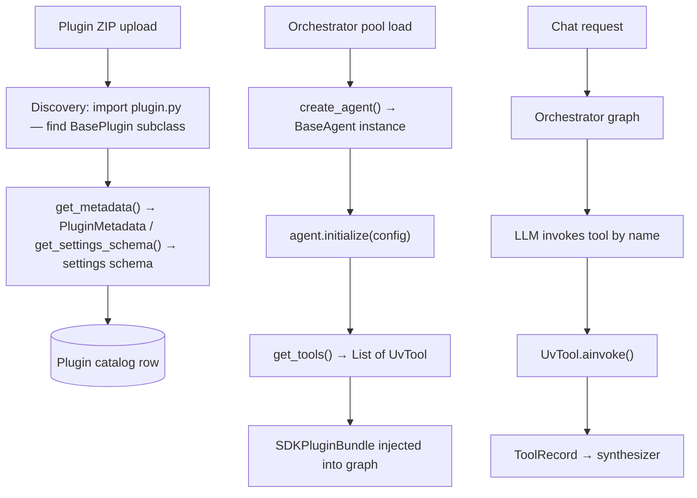

import { Aside, CardGrid, LinkCard, TabItem, Tabs } from '@astrojs/starlight/components';

The **Cadence SDK** (`cadence-sdk`) provides the Python building blocks for **AI agent** packages (the plugin format). A plugin exposes a `BasePlugin` subclass that the platform discovers at upload time. The plugin is a **factory** — it produces `BaseAgent` instances that supply tools to the AI App graph. The framework owns all LLM calls, routing, and continue/stop decisions; plugins focus on tools and domain logic.

## Architecture overview



## BasePlugin

`BasePlugin` is the required entry point for every plugin. It is a **stateless factory** — the class itself holds no per-request state.

```python title="sdk/src/cadence_sdk/base/plugin.py"
class BasePlugin(ABC):
    @staticmethod
    @abstractmethod
    def get_metadata() -> PluginMetadata:
        """Return PluginMetadata describing pid, version, and capabilities."""
        ...

    @staticmethod
    @abstractmethod
    def create_agent() -> BaseAgent:
        """Return a fresh BaseAgent instance. Called once per orchestrator load."""
        ...

    @staticmethod
    def validate_dependencies() -> List[str]:
        """Return error messages if required packages are missing, or []."""
        return []

    @staticmethod
    def get_settings_schema() -> List[Dict[str, Any]] | None:
        """Return settings schema. Alternative to @plugin_settings decorator."""
        return []

    @staticmethod
    def health_check() -> Dict[str, Any]:
        """Return health status dict. Called by pool health monitor."""
        return {"status": "unknown"}
```

### Required methods

| Method           | Returns          | Notes                                                                             |
| ---------------- | ---------------- | --------------------------------------------------------------------------------- |
| `get_metadata()` | `PluginMetadata` | Called at upload time for catalog registration and at load time for validation    |
| `create_agent()` | `BaseAgent`      | Called by the pool on orchestrator load; each call should return a fresh instance |

### Optional methods

| Method                    | Returns          | When to override                                                           |
| ------------------------- | ---------------- | -------------------------------------------------------------------------- |
| `validate_dependencies()` | `List[str]`      | Return error strings for missing imports; prevents silent runtime failures |
| `get_settings_schema()`   | `List[Dict]`     | Alternative to `@plugin_settings`; use when schema is computed dynamically |
| `health_check()`          | `Dict[str, Any]` | Called by pool monitor; return `{"status": "ok"}` for healthy              |

## PluginMetadata

`PluginMetadata` is a dataclass that describes the plugin to the platform. It is returned by `BasePlugin.get_metadata()`.

```python title="sdk/src/cadence_sdk/base/metadata.py"
@dataclass
class PluginMetadata:
    pid: str                          # Required — reverse-domain e.g. "com.example.search"
    name: str                         # Required — human-readable display name
    version: str                      # Required — "MAJOR.MINOR" or "MAJOR.MINOR.PATCH"
    description: str                  # Required — capability description
    capabilities: List[str] = field(default_factory=list)   # e.g. ["search", "retrieval"]
    dependencies: List[str] = field(default_factory=list)   # pip packages e.g. ["requests>=2.28"]
    sdk_version: str = ">=2.0.0,<3.0.0"   # Compatible SDK version range
    stateless: bool = True
```

| Field          | Required | Notes                                                                                 |
| -------------- | -------- | ------------------------------------------------------------------------------------- |
| `pid`          | yes      | Globally unique reverse-domain identifier; registry key; immutable after registration |
| `name`         | yes      | Used as display name in UI and catalog                                                |
| `version`      | yes      | `MAJOR.MINOR` or `MAJOR.MINOR.PATCH`; higher version wins on conflict                 |
| `description`  | yes      | Shown in catalog                                                                      |
| `capabilities` | no       | Tag list used for discovery and filtering (e.g. `["web_search"]`)                     |
| `dependencies` | no       | Pip requirements; checked by `validate_dependencies()` if you inspect them manually   |
| `sdk_version`  | no       | SemVer range checked at load time against installed SDK version                       |
| `stateless`    | no       | Defaults to `True`; affects whether the platform may share agent instances            |

<Aside type="note" title="No LLM configuration in PluginMetadata">
  Since SDK v3.0, plugins do not declare model requirements. The framework owns all LLM
  configuration via the settings cascade. Plugins declare tools and domain logic only.
</Aside>

## BaseAgent

`BaseAgent` is the runtime counterpart to `BasePlugin`. It holds per-orchestrator state and exposes tools to the graph.

```python title="sdk/src/cadence_sdk/base/agent.py"
class BaseAgent(ABC):
    @abstractmethod
    def get_tools(self) -> List[UvTool]:
        """Return all tools this agent provides."""
        ...

    def initialize(self, config: Dict[str, Any]) -> None:
        """Optional — called once after create_agent(). Receives resolved settings."""
        pass

    async def cleanup(self) -> None:
        """Optional — called when the orchestrator unloads. Close connections here."""
        pass
```

### Agent subtypes

| Class                  | Use case                                                                                                         |
| ---------------------- | ---------------------------------------------------------------------------------------------------------------- |
| `BaseAgent`            | General-purpose agent; works in supervisor mode                                                                  |
| `BaseSpecializedAgent` | Adds `get_system_prompt()` — describes capabilities to the orchestrator's router; for multi-agent topologies     |
| `BaseScopedAgent`      | Adds `load_anchor()` and `build_scope_rules()` — for grounded mode where every request is anchored to a resource |

```python title="sdk/src/cadence_sdk/base/agent.py"
class BaseSpecializedAgent(BaseAgent, ABC):
    @abstractmethod
    def get_system_prompt(self) -> str:
        """Describe this agent's tools to the orchestrator's router and planner."""
        ...

class BaseScopedAgent(BaseAgent, ABC):
    @abstractmethod
    async def load_anchor(self, resource_id: str) -> Dict[str, Any]:
        """Load the primary context for the anchor resource (URL, ID, slug).
        Called once per conversation. Return {} if not found."""
        ...

    @abstractmethod
    def build_scope_rules(self, context: Dict[str, Any]) -> str:
        """Return a scope instruction string derived from the anchor context."""
        ...
```

`BaseScopedAgent` is used in **grounded mode** orchestrators. `load_anchor()` receives the `resource_id` from the chat request and returns a dict injected into the system prompt. `build_scope_rules()` generates the constraint text that tells the agent what is in/out of bounds.

## UvTool

`UvTool` is the framework-agnostic tool wrapper. Every tool returned by `get_tools()` must be a `UvTool` instance. The `@uvtool` decorator is the most ergonomic way to create one.

```python title="sdk/src/cadence_sdk/types/sdk_tools.py"
class UvTool:
    name: str                     # Tool name — used for LLM invocation
    description: str              # Passed to the LLM as the tool's purpose
    func: Callable                # Sync or async callable
    args_schema: type[BaseModel]  # Optional Pydantic schema for argument validation
    required_validate: bool       # If True, validator node inspects this result
    stream_tool: bool             # If True, result streams to client before synthesizer
    stream_filter: Callable       # Applied to result before streaming (removes internal fields)
    is_async: bool                # Detected automatically from func
```

### @uvtool decorator

```python title="@uvtool examples"
@uvtool
def search(query: str) -> list:
    """Search for documents matching the query."""
    return search_backend(query)

@uvtool(name="fetch_page", stream=True, stream_filter=lambda r: {"title": r["title"]})
async def fetch_page(url: str) -> dict:
    """Fetch and parse a web page."""
    return await http_client.get(url)

@uvtool(validate=True, args_schema=ProductSearchArgs)
async def product_search(query: str, limit: int = 10) -> list:
    """Search the product catalog."""
    return await catalog.search(query, limit=limit)
```

### UvTool parameters

| Parameter       | Type           | Notes                                                                                                |
| --------------- | -------------- | ---------------------------------------------------------------------------------------------------- |
| `name`          | string         | Defaults to function name                                                                            |
| `description`   | string         | Defaults to function docstring first line                                                            |
| `args_schema`   | Pydantic model | Optional; used for argument validation and LLM schema generation                                     |
| `stream`        | bool           | When `True`, result is streamed to the client via SSE before the synthesizer runs                    |
| `stream_filter` | callable       | Applied to the raw result before streaming — use to remove internal fields                           |
| `validate`      | bool           | When `True`, sets `required_validate=True` on the `ToolRecord` so the validator node inspects output |

## UvState

`UvState` is the shared state contract between the service layer and the orchestration framework adapters.

```python title="sdk/src/cadence_sdk/types/sdk_state.py"
class UvState(TypedDict, total=False):
    messages: List[AnyMessage]       # Conversation history
    thread_id: Optional[str]         # Conversation thread identifier
    resource_id: Optional[str]       # Anchor resource for grounded mode
    user_intent: Optional[str]       # Extracted user intent (set by router node)
```

Plugin tools can read `resource_id` from state to scope their queries:

```python
resource_id = state.get("resource_id")
results = await db.query(doc_id=resource_id, question=query)
```

## @plugin_settings decorator

Use `@plugin_settings` to declare configuration requirements. The framework merges these settings with org-level overrides and passes the resolved dict to `agent.initialize(config)`.

```python title="@plugin_settings"
@plugin_settings([
    {
        "key": "api_key",
        "name": "Service API Key",
        "type": "str",
        "required": True,
        "sensitive": True,
        "description": "API key for authenticating with the search service"
    },
    {
        "key": "max_results",
        "name": "Max Results",
        "type": "int",
        "default": 10,
        "description": "Maximum number of results to return per query"
    }
])
class SearchPlugin(BasePlugin):
    ...
```

### Settings field reference

| Field         | Required | Type   | Notes                                            |
| ------------- | -------- | ------ | ------------------------------------------------ |
| `key`         | yes      | string | Machine-readable identifier; unique per plugin   |
| `type`        | yes      | string | `str`, `int`, `float`, `bool`, `list`, `dict`    |
| `description` | yes      | string | Shown in UI settings form                        |
| `name`        | no       | string | Display label; defaults to `key`                 |
| `default`     | no       | any    | Default value; type must match `type`            |
| `required`    | no       | bool   | If true, plugin fails to load without this value |
| `sensitive`   | no       | bool   | Encrypted at rest; masked in logs and UI         |

<Aside type="note" title="Both approaches work">
  You can use `@plugin_settings` OR override `get_settings_schema()` on `BasePlugin`. If both are
  present, the decorator combines them. Use the decorator for static schemas and
  `get_settings_schema()` when the schema must be computed at runtime.
</Aside>

## PluginRegistry

The `PluginRegistry` singleton manages all loaded plugins. Plugins are keyed by `pid`; only the highest-version registration wins when the same `pid` appears multiple times.

```python title="sdk/src/cadence_sdk/registry/plugin_registry.py"
registry = PluginRegistry.instance()

registry.register(MyPlugin)                         # Register a plugin class
registry.get_plugin("com.example.search")           # Look up by pid
registry.list_plugins_by_capability("search")       # Filter by capability tag
registry.list_plugins_by_type("scoped")             # "specialized" or "scoped"
```

The convenience function `register_plugin(MyPlugin)` is equivalent to `PluginRegistry.instance().register(MyPlugin)`.

## Complete plugin example

<Tabs>
  <TabItem label="Basic agent">

```python title="plugin.py"
from cadence_sdk import (
    BasePlugin, BaseAgent,
    PluginMetadata, UvTool, uvtool,
    plugin_settings,
)
import httpx


class SearchAgent(BaseAgent):
    def __init__(self):
        self.api_key: str = ""
        self.max_results: int = 10

    def initialize(self, config: dict) -> None:
        self.api_key = config["api_key"]
        self.max_results = config.get("max_results", 10)

    def get_tools(self) -> list[UvTool]:
        return [self.search]

    @uvtool
    async def search(self, query: str) -> list[dict]:
        """Search for documents matching the query."""
        async with httpx.AsyncClient() as client:
            resp = await client.get(
                "https://api.example.com/search",
                params={"q": query, "limit": self.max_results},
                headers={"Authorization": f"Bearer {self.api_key}"},
            )
            return resp.json()["results"]

    async def cleanup(self) -> None:
        pass


@plugin_settings([
    {"key": "api_key", "type": "str", "required": True,
     "sensitive": True, "description": "Example service API key"},
    {"key": "max_results", "type": "int", "default": 10,
     "description": "Max results per query"},
])
class SearchPlugin(BasePlugin):
    @staticmethod
    def get_metadata() -> PluginMetadata:
        return PluginMetadata(
            pid="com.example.doc-search",
            name="Document Search",
            version="1.0.0",
            description="Full-text search over the document catalog",
            capabilities=["search", "retrieval"],
        )

    @staticmethod
    def create_agent() -> SearchAgent:
        return SearchAgent()

    @staticmethod
    def validate_dependencies() -> list[str]:
        errors = []
        try:
            import httpx  # noqa: F401
        except ImportError:
            errors.append("httpx is required but not installed")
        return errors
```

  </TabItem>
  <TabItem label="Grounded (scoped) agent">

```python title="plugin.py"
from cadence_sdk import (
    BasePlugin, BaseScopedAgent,
    PluginMetadata, UvTool, uvtool,
)
from typing import Any


class DocumentAgent(BaseScopedAgent):
    async def load_anchor(self, resource_id: str) -> dict[str, Any]:
        """Load document by ID — called once per conversation."""
        doc = await db.get_document(resource_id)
        return doc or {}

    def build_scope_rules(self, context: dict[str, Any]) -> str:
        title = context.get("title", "this document")
        return (
            f"Answer only from '{title}'. "
            "Do not use outside knowledge or other documents."
        )

    def get_tools(self) -> list[UvTool]:
        return [self.get_section]

    @uvtool
    async def get_section(self, section_name: str) -> str:
        """Get a specific section from the anchored document."""
        return await db.get_section(section_name)


class DocumentPlugin(BasePlugin):
    @staticmethod
    def get_metadata() -> PluginMetadata:
        return PluginMetadata(
            pid="com.example.document-qa",
            name="Document QA",
            version="1.0.0",
            description="Question answering scoped to a single document",
            capabilities=["retrieval"],
        )

    @staticmethod
    def create_agent() -> DocumentAgent:
        return DocumentAgent()
```

  </TabItem>
</Tabs>

## SDK package structure

```
cadence-sdk/
├── sdk/src/cadence_sdk/
│   ├── base/
│   │   ├── plugin.py       # BasePlugin
│   │   ├── agent.py        # BaseAgent, BaseSpecializedAgent, BaseScopedAgent
│   │   ├── metadata.py     # PluginMetadata
│   │   ├── exceptions.py   # SDK exception types
│   │   └── loggable.py     # LoggableMixin helper
│   ├── decorators/
│   │   └── settings_decorators.py  # @plugin_settings, get_plugin_settings_schema
│   ├── registry/
│   │   ├── plugin_registry.py      # PluginRegistry singleton, register_plugin()
│   │   └── contracts.py            # PluginContract (internal platform use)
│   ├── types/
│   │   ├── sdk_tools.py    # UvTool, @uvtool, ToolRecord
│   │   ├── sdk_state.py    # UvState
│   │   └── sdk_messages.py # AnyMessage
│   └── utils/
│       ├── installers.py   # Dependency install helpers
│       └── validation.py   # Schema and version validation utilities
```

## Troubleshooting

| Symptom                                         | Cause                                                    | Fix                                                                                  |
| ----------------------------------------------- | -------------------------------------------------------- | ------------------------------------------------------------------------------------ |
| `TypeError: must inherit from BasePlugin`       | Plugin class doesn't extend `BasePlugin`                 | Ensure `class MyPlugin(BasePlugin)`                                                  |
| Discovery fails — no `BasePlugin` found in ZIP  | `plugin.py` missing or class not at module level         | Place `BasePlugin` subclass directly in `plugin.py`                                  |
| `validate_dependencies` returns errors          | Missing pip package                                      | Add to `pyproject.toml` dependencies and re-upload                                   |
| `initialize` not receiving settings             | `active_plugin_ids` referencing wrong pid                | Match `pid` in `PluginMetadata` with `active_plugin_ids` entry                       |
| `load_anchor` never called                      | Using `BaseScopedAgent` in supervisor mode, not grounded | Switch orchestrator to `mode: grounded` or use `BaseAgent` instead                   |
| Tools not visible to LLM                        | `get_tools()` returns empty list                         | Return all `UvTool` instances from `get_tools()`                                     |
| Tool result streamed but contains internal data | `stream_filter` not set                                  | Pass `stream_filter=lambda r: {k: v for k, v in r.items() if not k.startswith("_")}` |
| Version conflict at registration                | Same `pid` registered twice                              | Higher version wins; use unique `pid` or increment version                           |

## Next steps

<CardGrid>
  <LinkCard
    title="AI Agent system"
    href="/features/plugin-system/"
    description="Upload, attachment, and runtime loading — API reference and lifecycle."
  />
  <LinkCard
    title="Orchestration modes"
    href="/features/orchestration-modes/"
    description="How supervisor and grounded modes use plugin agents and tools."
  />
  <LinkCard
    title="Hot-reload and orchestrator pool"
    href="/features/hot-reload-ai-app-pool/"
    description="Load, unload, and reload orchestrators to pick up updated plugins."
  />
</CardGrid>
