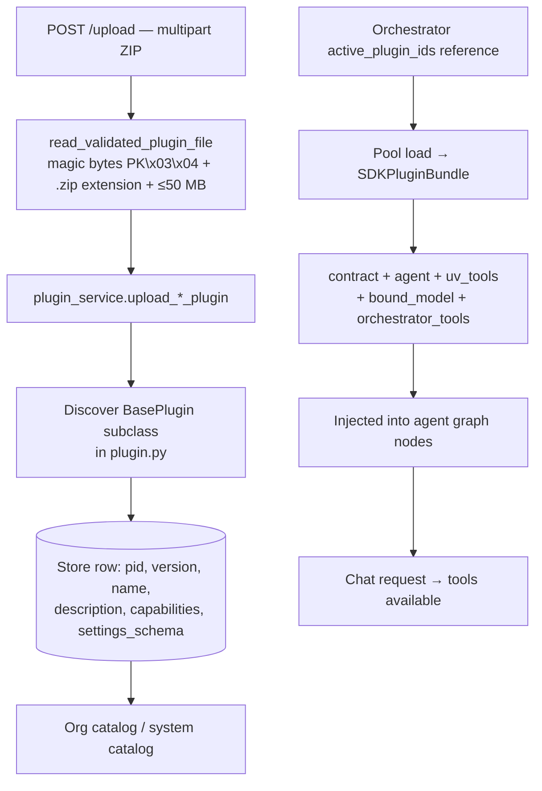

import { Aside, CardGrid, LinkCard, Steps } from '@astrojs/starlight/components';

An **AI agent** in the product sense is a **plugin** ZIP archive containing a Python `BasePlugin` subclass and tools. Plugin packages move
through three states before they reach users: **uploaded** (stored and discovered), **attached**
(referenced in an AI App's `active_plugin_ids`), and **loaded** (the running pool instance
has initialized the plugin's code path). All three must be true for chat requests to reach
plugin-defined tools.

## Architecture overview



## The plugin lifecycle

**Upload** stores the ZIP and immediately runs **discovery** to find the `BasePlugin` subclass —
no separate registration step is required.

**Attachment** means an orchestrator row's `active_plugin_ids` array includes the plugin id.
Saving the orchestrator config does not affect the running pool instance.

**Loading** means the pool has initialized the plugin for a running orchestrator instance.
If the orchestrator was running before the upload or attachment, a load or reload is required.
See [Hot-reload and orchestrator pool](/features/hot-reload-ai-app-pool/).

## Data model

### Plugin catalog fields

Both system and org plugins share these core fields:

| Field              | Type           | Notes                                                                                |
| ------------------ | -------------- | ------------------------------------------------------------------------------------ |
| `id`               | UUID           | Database primary key                                                                 |
| `pid`              | string         | Reverse-domain identifier (e.g. `com.example.search`) — globally unique registry key |
| `version`          | string         | Semantic version (`MAJOR.MINOR` or `MAJOR.MINOR.PATCH`)                              |
| `name`             | string         | Human-readable display name                                                          |
| `description`      | string         | Plugin capability description                                                        |
| `tag`              | string \| null | Optional category tag for filtering                                                  |
| `capabilities`     | string[]       | Capability tag list (e.g. `["search", "retrieval"]`)                                 |
| `is_specialized`   | boolean        | Agent is a `BaseSpecializedAgent` (multi-agent topology)                             |
| `is_scoped`        | boolean        | Agent is a `BaseScopedAgent` (grounded mode support)                                 |
| `stateless`        | boolean        | Plugin declares stateless operation                                                  |
| `settings_schema`  | JSON[]         | Per-key settings definition for UI and initialization                                |
| `default_settings` | JSON           | Default values for settings keys                                                     |
| `is_latest`        | boolean        | Whether this is the most recent version for its `pid`                                |
| `enabled`          | boolean        | Whether the plugin is available for use                                              |
| `logo_image`       | string \| null | Base64 or URL logo for the UI                                                        |

### Settings schema item

Each entry in `settings_schema` has this shape:

| Field         | Type    | Required | Notes                                                |
| ------------- | ------- | -------- | ---------------------------------------------------- |
| `key`         | string  | yes      | Machine-readable setting identifier                  |
| `name`        | string  | no       | Display label (defaults to `key` if omitted)         |
| `type`        | string  | yes      | One of `str`, `int`, `float`, `bool`, `list`, `dict` |
| `description` | string  | yes      | Human-readable description shown in UI               |
| `default`     | any     | no       | Default value; type must match `type`                |
| `required`    | boolean | no       | If true, must be provided before the plugin can load |
| `sensitive`   | boolean | no       | Masked in logs and UI; stored encrypted              |

## API reference

### Org-scoped plugins

| Method   | Path                                               | Permission                  | Description                                             |
| -------- | -------------------------------------------------- | --------------------------- | ------------------------------------------------------- |
| `GET`    | `/api/orgs/{org_id}/plugins`                       | `cadence:org:plugins:read`  | List org + system plugins combined; filter with `?tag=` |
| `GET`    | `/api/orgs/{org_id}/plugins/{pid}/versions`        | `cadence:org:plugins:read`  | All versions of a plugin by pid; `?source=org\|system`  |
| `POST`   | `/api/orgs/{org_id}/plugins/upload`                | `cadence:org:plugins:write` | Upload a ZIP plugin to the org catalog                  |
| `PATCH`  | `/api/orgs/{org_id}/plugins/{plugin_id}`           | `cadence:org:plugins:write` | Enable or disable an org plugin                         |
| `DELETE` | `/api/orgs/{org_id}/plugins/{plugin_id}`           | `cadence:org:plugins:write` | Disable an org plugin (sets `enabled=false`)            |
| `GET`    | `/api/orgs/{org_id}/plugins/{pid}/settings-schema` | `cadence:org:plugins:read`  | Fetch settings schema for dynamic UI rendering          |

### System plugins (admin)

| Method   | Path                                | Permission                     | Description                                                 |
| -------- | ----------------------------------- | ------------------------------ | ----------------------------------------------------------- |
| `GET`    | `/api/admin/plugins`                | `cadence:system:plugins:read`  | List all system plugins; `?include_disabled=true` (default) |
| `POST`   | `/api/admin/plugins/upload`         | `cadence:system:plugins:write` | Upload a ZIP to the system catalog                          |
| `GET`    | `/api/admin/plugins/{pid}/versions` | `cadence:system:plugins:read`  | List all versions for a system plugin                       |
| `GET`    | `/api/admin/plugins/{plugin_id}`    | `cadence:system:plugins:read`  | Get one system plugin by ID                                 |
| `PATCH`  | `/api/admin/plugins/{plugin_id}`    | `cadence:system:plugins:write` | Enable or disable a system plugin                           |
| `DELETE` | `/api/admin/plugins/{plugin_id}`    | `cadence:system:plugins:write` | Disable a system plugin                                     |

## How it works — upload and discovery

<Steps>

1. The client posts `multipart/form-data` with a `file` field to the upload endpoint.
2. `read_validated_plugin_file` validates the file: extension must be `.zip`, first 4 bytes must be `PK\x03\x04` (ZIP magic bytes), and size must not exceed 50 MB.
3. `plugin_service.upload_*_plugin` extracts the ZIP to the filesystem and runs the discovery process — it imports `plugin.py` from the archive and scans for a `BasePlugin` subclass.
4. The discovered class's `get_metadata()` and `get_settings_schema()` are called to extract `pid`, `version`, `name`, `description`, `capabilities`, and the settings schema.
5. A row is written to the plugin catalog. The response returns `id`, `pid`, `version`, and `org_id`.

</Steps>

```python title="cadence/api/plugin.py"
zip_bytes = await read_validated_plugin_file(file)
plugin_service = request.app.state.plugin_service

plugin = await plugin_service.upload_organization_plugin(
    org_id=context.org_id,
    zip_bytes=zip_bytes,
    caller_id=context.user_id,
    org_domain=org_domain,
)

return {
    "message": "Plugin uploaded successfully",
    "id": str(plugin.id),
    "pid": plugin.pid,
    "version": plugin.version,
    "org_id": context.org_id,
}
```

## How it works — org vs. system plugins

**Org plugins** are uploaded by org admins and appear only in that org's catalog.
Reference them in `active_plugin_ids` on any orchestrator in that org.

**System plugins** are uploaded by `sys_admin` and are globally available. They appear
in every org's plugin list alongside that org's private plugins. Use system plugins for
platform capabilities that all tenants should be able to enable.

<Aside type="caution" title="Plugin code runs in-process">
  Plugin code executes inside the orchestrator worker process with the same trust level as the
  platform itself. Only upload ZIP files from trusted authors. Never embed API keys or secrets
  directly in the archive — declare them as `sensitive` settings instead.
</Aside>

## How it works — settings schema and initialization

When an org admin configures a plugin, the UI calls
`GET /api/orgs/{org_id}/plugins/{pid}/settings-schema` to retrieve the declared settings.
Filled-in values are stored in the orchestrator's `plugin_settings` JSON field and passed
as `config` to `agent.initialize(config)` when the orchestrator loads.

```python title="cadence/api/plugin.py"
schema = plugin_service.get_settings_schema(plugin_pid, context.org_id)
return [PluginSettingSchema(**setting) for setting in schema]
```

## Attaching a plugin to an orchestrator

<Steps>

1. Upload the plugin ZIP and note the returned `pid`.
2. Create or update an orchestrator with the `pid` in `active_plugin_ids` (see the JSON example below for `POST /api/orgs/{org_id}/orchestrators`).
3. Load the orchestrator instance into the pool. The pool will call `create_agent()` on the plugin class and bundle its tools into the graph.
4. Send a chat request — tool calls now route through the plugin.

</Steps>

```json title="POST /api/orgs/{org_id}/orchestrators"
{
  "name": "Support Agent",
  "framework_type": "langgraph",
  "mode": "supervisor",
  "active_plugin_ids": ["com.example.support-tools"],
  "config": { "default_llm_config_id": "<uuid>" }
}
```

## ZIP structure requirements

A valid plugin ZIP must contain at minimum:

```
my_plugin.zip
├── plugin.py          # Required — must define a BasePlugin subclass
└── pyproject.toml     # Required — package metadata
```

Additional Python files, data files, and sub-packages are allowed. The discovery process imports `plugin.py` and scans all top-level names for `BasePlugin` subclasses.

## Troubleshooting

| Symptom                                             | Cause                                                       | Fix                                                                   |
| --------------------------------------------------- | ----------------------------------------------------------- | --------------------------------------------------------------------- |
| `400 Invalid plugin file`                           | Wrong file extension, bad magic bytes, or file > 50 MB      | Use `.zip` file under 50 MB; re-zip if file is corrupted              |
| Upload succeeds but no tools in chat                | Plugin not in `active_plugin_ids`, or instance not reloaded | Verify `active_plugin_ids`; reload instance via pool API              |
| `404` on settings-schema                            | Plugin pid not in registry for this org                     | Verify the plugin is uploaded and `enabled=true`                      |
| Tools appear but fail at runtime                    | `required` settings not filled in                           | Check `plugin_settings` on the orchestrator; fill all required fields |
| Version confusion after re-upload                   | Running instance has stale code                             | Reload the orchestrator via `POST .../load`                           |
| Plugin discovered but `validate_dependencies` fails | Python package missing in plugin's `pyproject.toml`         | Add the missing package and re-upload                                 |
| System plugin not visible to org                    | Plugin is `enabled=false`                                   | Enable via `PATCH /api/admin/plugins/{id}`                            |

## Next steps

<CardGrid>
  <LinkCard
    title="AI Agent SDK"
    href="/features/plugin-sdk/"
    description="BasePlugin, BaseAgent, UvTool, PluginMetadata, and the full SDK reference."
  />
  <LinkCard
    title="Orchestration backends"
    href="/features/orchestration-backends/"
    description="Create orchestrators and configure active_plugin_ids."
  />
  <LinkCard
    title="Hot-reload and orchestrator pool"
    href="/features/hot-reload-ai-app-pool/"
    description="Load and unload instances to pick up new plugin versions."
  />
</CardGrid>
