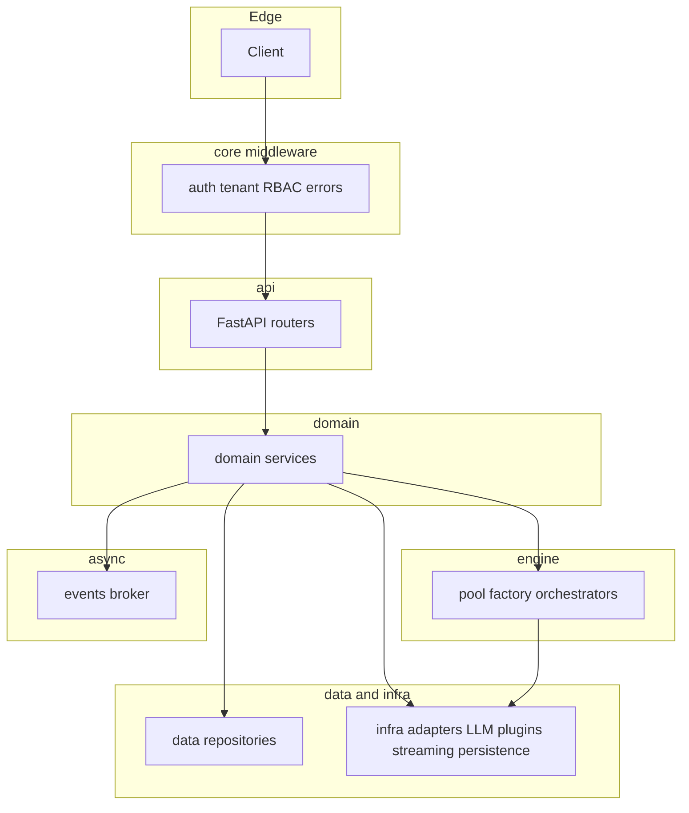
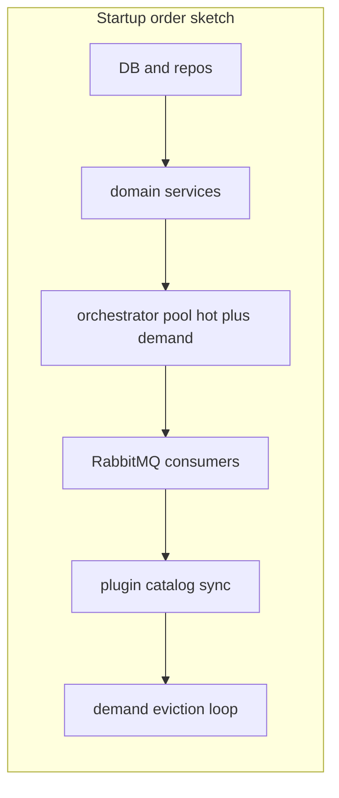
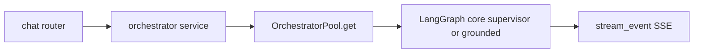
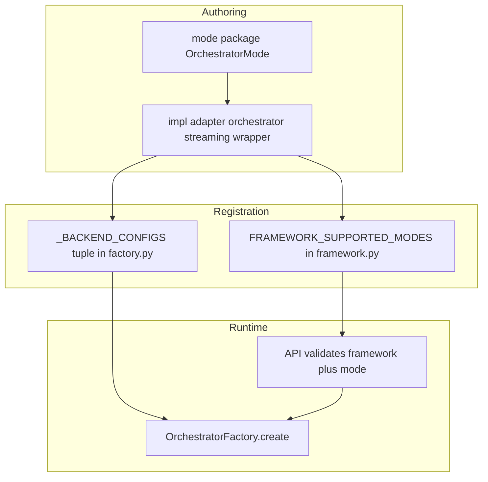

**Project:** cadence · **Languages:** Python, Bash · **Frameworks:** FastAPI, SQLAlchemy, Alembic, Pydantic · **Description:** Multi-tenant, multi-orchestrator AI agent platform.

This page orients **contributors** to the repository: where code lives, how layers relate, and which files are especially complex. For product-level behavior, see [How the platform works](/concepts/how-it-works/), [Multi-tenancy](/features/multi-tenancy/), [Plugin system](/features/plugin-system/), [Hot reload AI App pool](/features/hot-reload-ai-app-pool/), [Real-time streaming](/features/real-time-streaming/), [Role-based access control](/features/role-based-access-control/), and [Configuration](/guides/configuration/).

## Project overview

Cadence is a **multi-tenant AI agent platform** that lets organizations deploy and manage AI orchestrators backed by different frameworks (LangGraph, Google ADK, OpenAI Agents). Each tenant (organization) can configure its own LLM providers, install plugins, and create orchestrator instances that run in a managed pool.

**Key characteristics**

| Characteristic       | What it means                                                                       |
| -------------------- | ----------------------------------------------------------------------------------- |
| Multi-tenant         | Every resource is scoped to an organization; users belong to orgs via memberships.  |
| Multi-framework      | LangGraph, Google ADK, and OpenAI Agents backends are first-class.                  |
| Plugin-driven        | Agent capabilities are extended via versioned plugins uploaded as ZIP packages.     |
| Hot + demand pooling | Orchestrators run in a two-tier pool — always-on (hot) and on-demand (TTL-evicted). |
| OAuth2 + RBAC        | Full OAuth2 authorization server with role-based access control.                    |
| Streaming            | Chat responses are streamed over SSE (Server-Sent Events).                          |

## Architecture layers

Typical **request flow** moves down the stack and returns up: HTTP enters **`api/`** (after **`core/middleware/`**), **domain** services orchestrate rules and call **data** repositories and **infra** adapters; **engine** runs orchestrator graphs and may call **infra** (LLM, plugins, streaming). **Events** publish side effects asynchronously.



### API layer (`src/cadence/api/`)

HTTP routes, FastAPI routers, and request/response handling. Each subdomain has its own router and schemas.

| Subdomain              | Purpose                                                                       |
| ---------------------- | ----------------------------------------------------------------------------- |
| `admin/`               | Platform-level admin: tiers, global settings, pool health, provider catalog   |
| `auth/`                | Login, token exchange, session management                                     |
| `chat/`                | Chat endpoints with SSE streaming                                             |
| `oauth2/`              | Authorization server: authorize, token, userinfo, discovery                   |
| `orchestrator/`        | Orchestrator CRUD, lifecycle (reload/delete), plugin attachment, graph routes |
| `plugins/`             | Org-scoped and system plugin management                                       |
| `tenant/`              | Organizations, users, memberships, LLM config                                 |
| `api_key/`             | API key issuance and management                                               |
| `stats/`, `telemetry/` | Usage stats and observability                                                 |
| `common/`              | Shared decorators, dependency injectors, validators                           |

### Core (`src/cadence/core/`)

Application wiring, configuration, and cross-cutting concerns.

| File / area                          | Purpose                                                      |
| ------------------------------------ | ------------------------------------------------------------ |
| `src/cadence/main.py` (package root) | ASGI app factory — creates the FastAPI app                   |
| `lifespan.py`                        | Startup/shutdown: DB init, pool bootstrap, event consumers   |
| `router.py`                          | Registers all API routers                                    |
| `config.py`                          | Environment-driven config (`CADENCE_*` env vars)             |
| `middleware_setup.py`                | Mounts all middleware in order                               |
| `authorization/`                     | RBAC provider, permission checks, built-in role definitions  |
| `constants/`                         | Agent types, framework names, provider model IDs             |
| `exceptions/`                        | Typed exception hierarchy (auth, LLM, plugin, rate-limit, …) |
| `types/`                             | Shared DTOs and plugin type definitions                      |

The FastAPI entrypoint lives at **`src/cadence/main.py`** (not under `core/`). Core modules are imported from there.

### Middleware (`src/cadence/core/middleware/`)

Runs on every request before it reaches a router.

| File                | Purpose                                                      |
| ------------------- | ------------------------------------------------------------ |
| `authentication.py` | Validates Bearer token / API key; populates request identity |
| `authorization.py`  | Checks RBAC permissions for the resolved identity            |
| `tenant_context.py` | Injects org context into request state                       |
| `error_handler.py`  | Catches typed exceptions and maps them to HTTP responses     |
| `rate_limiting.py`  | Per-tenant rate limiting                                     |

See [How the platform works](/concepts/how-it-works/) for inbound order and failure modes.

### Domain (`src/cadence/domain/`)

Business rules and service objects — the application logic layer.

| Subdomain       | Purpose                                                         |
| --------------- | --------------------------------------------------------------- |
| `auth/`         | Login, OAuth2 consent flow, token service, social login         |
| `orchestrator/` | Chat dispatch, orchestrator config validation                   |
| `plugins/`      | Plugin install, inspection, dependency resolution, AST scanning |
| `settings/`     | Cascading config (global → org → instance)                      |
| `tenant/`       | Org and user management                                         |
| `rbac/`         | Role assignment and lookup                                      |
| `messaging/`    | Conversation and message lifecycle                              |
| `telemetry/`    | Telemetry config                                                |
| `common/`       | Context policy, quota, org LLM config helpers                   |

### Data access (`src/cadence/data/`)

Repository pattern over PostgreSQL and Redis. No business logic here.

| Subdomain       | Purpose                                                   |
| --------------- | --------------------------------------------------------- |
| `orchestrator/` | CRUD for orchestrator instance rows                       |
| `organization/` | Org settings, LLM config, plugin catalog                  |
| `user/`         | User accounts, memberships, OAuth identities              |
| `plugins/`      | Plugin store (filesystem + S3), system catalog            |
| `security/`     | API keys, OAuth2 clients, session store (Redis JWT `jti`) |
| `messaging/`    | Messages (primary + optional read replica)                |
| `rbac/`         | Role lookups                                              |

### Infrastructure (`src/cadence/infra/`)

Concrete adapters for external systems.

| Subdomain                    | Purpose                                                          |
| ---------------------------- | ---------------------------------------------------------------- |
| `persistence/postgresql/`    | Async SQLAlchemy engine, ORM models, Alembic migrations          |
| `persistence/redis/`         | Redis client, pub/sub, cache helpers                             |
| `persistence/s3/`            | S3/MinIO client for plugin package storage                       |
| `llm/`                       | LLM factory with BYOK (Bring Your Own Key) support               |
| `plugins/`                   | Plugin loader, bundle builder, settings resolver, plugin manager |
| `brokers/rabbitmq_client.py` | RabbitMQ connection and channel management                       |
| `streaming/`                 | SSE stream event types                                           |
| `security/encryption.py`     | Symmetric encryption for stored secrets                          |
| `telemetry/`                 | OpenTelemetry setup, exporters, LLM instrumentors                |

### Engine (`src/cadence/engine/`)

The orchestrator runtime — the most complex layer.

| Subdomain / file             | Purpose                                                               |
| ---------------------------- | --------------------------------------------------------------------- |
| `base/`                      | Abstract `BaseOrchestrator`, adapter base, settings schemas           |
| `factory.py`                 | Creates orchestrator instances: registry lookup → plugin load → init  |
| `pool/pool.py`               | Two-tier pool (hot dict + demand TTL map) with eviction               |
| `pool/demand_pool.py`        | TTL-based demand pool (default 1 hr, cap 500)                         |
| `modes/`                     | Abstract mode classes: supervisor, grounded, coordinator, pipeline, … |
| `impl/langgraph/supervisor/` | LangGraph supervisor: classifier → planner → executor pipeline        |
| `impl/langgraph/grounded/`   | LangGraph grounded: single scoped agent anchored to a record          |
| `impl/google_adk/`           | Google ADK backend implementations                                    |
| `impl/openai_agents/`        | OpenAI Agents backend implementations                                 |
| `shared_resources/`          | Shared LLM model pool, bundle cache, template cache                   |
| `utils/`                     | Message utilities, state helpers, error utils, validation formatting  |

### Events (`src/cadence/events/`)

RabbitMQ-based domain events for cross-service coordination.

| Subdomain       | Purpose                                                        |
| --------------- | -------------------------------------------------------------- |
| `broker.py`     | RabbitMQ entrypoint / event dispatcher                         |
| `orchestrator/` | Publish/consume orchestrator reload and lifecycle events       |
| `plugin/`       | Publish/consume plugin install/remove events                   |
| `settings/`     | Publish/consume settings changes (with token TTL invalidation) |

### Operations (`migrations/`, `docker/`)

Database migrations (Alembic), seed scripts, and Docker entrypoint.

## Key concepts

### Multi-tenancy

Every non-admin resource is scoped to an organization. Users are linked to orgs via membership records with roles. Tenant context middleware resolves the org from the request and injects it into request state. See [Multi-tenancy](/features/multi-tenancy/).

### Orchestrator pool (two-tier)

Orchestrators are expensive to initialize (LLM clients, plugin loading, graph build). The pool keeps them alive:

- **Hot tier** — Instances listed in the hot-tier config are loaded at startup and kept alive indefinitely.
- **Demand tier** — Other instances load on first request and TTL-evict after inactivity (default: 1 hr, max 500).

Every removal path (manual delete, reload, TTL eviction, shutdown) calls `orchestrator.cleanup()`. See [Hot reload AI App pool](/features/hot-reload-ai-app-pool/) and [Orchestrator load, plugins, and settings](/guides/orchestrator-load-and-plugin-settings/) for how `OrchestratorPool.get` cold-loads from the DB through `OrchestratorFactory` and plugin bundles.

### Plugin system

Plugins extend agent capabilities. A plugin is a versioned ZIP package containing a Python class that implements the SDK `BasePlugin` interface. The install pipeline: upload → AST scan → dependency check → store (filesystem + S3) → catalog entry. At runtime, `SDKPluginManager.load_plugins()` downloads, loads, and wires plugin instances before the orchestrator is handed to the pool. See [Plugin system](/features/plugin-system/), [Plugin upload and verification](/guides/plugin-upload-pipeline/) (full upload pipeline in code), and [Plugin SDK](/features/plugin-sdk/).

### LangGraph orchestrators

Two primary LangGraph modes:

- **Supervisor** — Multi-agent pipeline: router → clarifier → planner → executor(s) → validator → synthesizer → responder.
- **Grounded** — Single-agent mode anchored to a specific record (for example a support ticket); uses `load_anchor` to seed context.

See [Orchestration modes](/features/orchestration-modes/) and [Orchestration backends](/features/orchestration-backends/).

### Settings cascade

Configuration flows from global platform settings → org-level overrides → per-instance overrides. The settings service resolves the effective config by merging these tiers. See [LLM configuration](/features/llm-configuration/) and [Configuration](/guides/configuration/).

### OAuth2 / RBAC

Cadence ships an OAuth2 authorization server (authorization code + PKCE, client credentials). RBAC roles are checked in authorization middleware using the authorization provider. Built-in roles live in `core/authorization/builtin_rbac.py`. See [Security and access](/concepts/security-and-access/) and [Role-based access control](/features/role-based-access-control/).

### Streaming (SSE)

Chat responses stream via Server-Sent Events. The streaming orchestrator wrapper emits stream events as the LLM produces tokens. Node lifecycle hooks emit start/end events at graph node boundaries. See [Real-time streaming](/features/real-time-streaming/) and [Chat and engine](/features/chat-and-engine/).

## Guided tour

Follow these files in order to trace a request from HTTP entry to AI response.

**Step 1 — Application entry** — `src/cadence/main.py`  
The ASGI app factory: creates the FastAPI app, attaches middleware, and registers the lifespan context manager.

**Step 2 — HTTP routing** — `src/cadence/core/router.py`  
Registers all API routers on the app — the single-file map of URL prefixes.

**Step 3 — Lifecycle** — `src/cadence/core/lifespan.py`  
Startup/shutdown: DB clients, repositories, domain services, orchestrator pool (hot + demand), RabbitMQ consumers, plugin catalog sync, pool eviction loop.



**After the tour — trace a chat request**



- `src/cadence/api/chat/router.py` — receives the SSE chat request
- `src/cadence/domain/orchestrator/service.py` — resolves the orchestrator from the pool
- `src/cadence/engine/pool/pool.py` — returns or cold-loads the orchestrator
- `src/cadence/engine/impl/langgraph/supervisor/core.py` or `grounded/core.py` — runs the graph
- `src/cadence/infra/streaming/stream_event.py` — events streamed back to the client

## File map

### Entry points

| File                           | What it does                     |
| ------------------------------ | -------------------------------- |
| `src/cadence/main.py`          | FastAPI app factory              |
| `src/cadence/core/lifespan.py` | Full startup/shutdown sequence   |
| `src/cadence/core/router.py`   | URL prefix → router registration |
| `src/cadence/core/config.py`   | All env-var config (`CADENCE_*`) |
| `docker/entrypoint.sh`         | Container entrypoint             |

### Engine core

| File                                            | What it does                                                     |
| ----------------------------------------------- | ---------------------------------------------------------------- |
| `src/cadence/engine/factory.py`                 | Creates fully initialized orchestrator instances                 |
| `src/cadence/engine/pool/pool.py`               | Two-tier orchestrator pool with hot + demand tiers               |
| `src/cadence/engine/pool/demand_pool.py`        | TTL-evicting demand pool                                         |
| `src/cadence/engine/base/orchestrator_base.py`  | Abstract base: `initialize()`, `cleanup()`, `_build_resources()` |
| `src/cadence/engine/modes/orchestrator_base.py` | Mode-level orchestrator base                                     |

### LangGraph supervisor

| File / directory                          | What it does                                                                          |
| ----------------------------------------- | ------------------------------------------------------------------------------------- |
| `…/langgraph/supervisor/core.py`          | Orchestrator class for supervisor mode                                                |
| `…/langgraph/supervisor/graph_builder.py` | Builds the LangGraph state machine                                                    |
| `…/langgraph/supervisor/nodes/`           | Graph nodes (router, planner, executor, validator, synthesizer, responder, clarifier) |
| `…/langgraph/supervisor/routing/edges.py` | Edge routing between nodes                                                            |
| `…/langgraph/supervisor/state.py`         | Shared graph state type                                                               |

### LangGraph grounded

| File / directory                        | What it does                                                                              |
| --------------------------------------- | ----------------------------------------------------------------------------------------- |
| `…/langgraph/grounded/core.py`          | Orchestrator class for grounded mode                                                      |
| `…/langgraph/grounded/graph_builder.py` | Builds the grounded graph                                                                 |
| `…/langgraph/grounded/nodes/`           | Grounded nodes (bootstrap, planner, executor, validator, synthesizer, router, suggestion) |
| `…/langgraph/grounded/routing/edges.py` | Grounded edge routing                                                                     |

### Plugin system

| File                                                    | What it does                                             |
| ------------------------------------------------------- | -------------------------------------------------------- |
| `src/cadence/infra/plugins/plugin_manager.py`           | Loads and manages plugin bundles at runtime              |
| `src/cadence/infra/plugins/plugin_loader.py`            | Downloads and imports plugin code                        |
| `src/cadence/infra/plugins/plugin_bundle_builder.py`    | Assembles a plugin bundle from metadata + loaded class   |
| `src/cadence/infra/plugins/plugin_settings_resolver.py` | Merges plugin settings (defaults + org overrides)        |
| `src/cadence/domain/plugins/service.py`                 | Install, remove, list plugins; system and org catalog    |
| `src/cadence/domain/plugins/inspector.py`               | Inspects plugin ZIP for tools, schemas, capabilities     |
| `src/cadence/domain/plugins/ast_scan.py`                | AST-based security/compliance scan of plugin code        |
| `src/cadence/data/plugins/store.py`                     | Two-level storage: filesystem cache + S3 source of truth |

### Auth and multi-tenancy

| File                                                     | What it does                                                |
| -------------------------------------------------------- | ----------------------------------------------------------- |
| `src/cadence/domain/auth/oauth2/authorization_server.py` | OAuth2 authorization server (grants, PKCE, consent)         |
| `src/cadence/domain/auth/oauth2/consent_service.py`      | Authorization-code consent flow and token revoke/introspect |
| `src/cadence/core/authorization/provider.py`             | RBAC authorization provider                                 |
| `src/cadence/core/authorization/builtin_rbac.py`         | Built-in role definitions                                   |
| `src/cadence/core/middleware/authentication.py`          | Token/API key validation                                    |
| `src/cadence/core/middleware/tenant_context.py`          | Org context injection                                       |

### Data and infrastructure

| File                                                     | What it does                        |
| -------------------------------------------------------- | ----------------------------------- |
| `src/cadence/infra/persistence/postgresql/models.py`     | All SQLAlchemy ORM models           |
| `src/cadence/infra/persistence/postgresql/migrations.py` | Alembic migration runner            |
| `src/cadence/infra/llm/factory.py`                       | LLM model factory with BYOK support |
| `src/cadence/events/broker.py`                           | RabbitMQ event dispatcher           |
| `src/cadence/data/security/session_store.py`             | Redis-backed JWT session store      |

### Settings and config

| File                                             | What it does                                            |
| ------------------------------------------------ | ------------------------------------------------------- |
| `src/cadence/domain/settings/service.py`         | Cascading settings resolution (global → org → instance) |
| `src/cadence/domain/settings/tenant_cascade.py`  | Org-level settings inheritance                          |
| `src/cadence/domain/settings/instance_config.py` | Per-instance configuration                              |

## Develop a new orchestrator mode

Cadence uses a **framework × mode** grid: each `(framework_type, mode)` maps to exactly three classes — an **adapter**, an **orchestrator** implementation, and a **streaming wrapper**. `OrchestratorFactory` in `src/cadence/engine/factory.py` resolves the triple and builds instances in a fixed pipeline. For product-level background, see [Orchestration modes](/features/orchestration-modes/) and [Orchestration backends](/features/orchestration-backends/).



### Concepts to understand first

| Concept                                    | Where                                           | Purpose                                                                        |
| ------------------------------------------ | ----------------------------------------------- | ------------------------------------------------------------------------------ |
| `BaseOrchestrator`                         | `src/cadence/engine/base/orchestrator_base.py`  | Abstract base every orchestrator implements                                    |
| `OrchestratorAdapter`                      | `src/cadence/engine/base/adapter_base.py`       | Converts SDK types ↔ framework-native types                                    |
| `BaseLangGraphOrchestrator`                | `src/cadence/engine/impl/langgraph/base.py`     | Shared LangGraph base: `astream`, `ask`, Langfuse wiring                       |
| `OrchestratorMode`                         | `src/cadence/engine/modes/orchestrator_base.py` | Config container for a mode (defaults + settings)                              |
| `OrchestratorFactory` / `_BACKEND_CONFIGS` | `src/cadence/engine/factory.py`                 | Registry of `(framework, mode)` → `(adapter, orchestrator, streaming_wrapper)` |
| `FRAMEWORK_SUPPORTED_MODES`                | `src/cadence/core/constants/framework.py`       | API-level validation; must stay aligned with the factory registry              |

Framework string values are `langgraph`, `openai_agents`, and `google_adk` (see the `Framework` enum in `src/cadence/core/constants/framework.py`).

### Step-by-step: add a new LangGraph mode

Use the LangGraph backend as the template unless you are implementing a **new framework** backend (see below). Mirror `src/cadence/engine/impl/langgraph/supervisor/` or `src/cadence/engine/impl/langgraph/grounded/`.

#### 1. Mode config class

**Location:** `src/cadence/engine/modes/<your_mode>/__init__.py`

Use `SupervisorMode` in `src/cadence/engine/modes/supervisor/__init__.py` as a reference (`SupervisorMode.__init__` from line 33 onward). Your class must:

- Extend `OrchestratorMode`
- Define a `defaults` dict for mode-specific settings
- Optionally instantiate a `LangGraphXxxSettings` Pydantic model when `framework == Framework.LANGGRAPH`

Then export the mode from `src/cadence/engine/modes/__init__.py`.

#### 2. Implementation package

**Location:** `src/cadence/engine/impl/langgraph/<your_mode>/`

Suggested layout (same shape as supervisor or grounded):

```text
src/cadence/engine/impl/langgraph/my_mode/
  __init__.py          # exports LangGraphMyMode
  core.py              # orchestrator class
  graph_builder.py     # compiles the LangGraph workflow
  state.py             # TypedDict graph state
  settings.py          # optional Pydantic per-node settings
  nodes/
    __init__.py
    my_node.py
  prompts/
    __init__.py
    my_node.py
  routing/
    __init__.py
    edges.py           # pure edge routing functions
```

#### 3. Graph state

**Location:** `src/cadence/engine/impl/langgraph/my_mode/state.py`

Use `TypedDict` and follow `src/cadence/engine/impl/langgraph/supervisor/state.py`: `Annotated` message lists with `add_messages`, plus mode-specific fields.

#### 4. Orchestrator class

**Location:** `src/cadence/engine/impl/langgraph/my_mode/core.py`

Subclass `BaseLangGraphOrchestrator` and implement:

| Method                                        | Role                                                                 |
| --------------------------------------------- | -------------------------------------------------------------------- |
| `_build_resources()`                          | Create LLM models and compile the graph; invoked from `initialize()` |
| `_build_initial_graph_state(lc_messages)`     | Starting `TypedDict` for a new run                                   |
| `_get_recursion_limit()`                      | LangGraph `recursion_limit` (tie to hop limits in config)            |
| `_map_result_to_output(result, output_state)` | Map graph output into SDK-facing state                               |
| `get_stream_data_before_graph_start()`        | Optional first stream event (e.g. `StreamEvent.agent_start(...)`)    |
| `mode` (property)                             | Return your mode string (e.g. `"my_mode"`)                           |

Optional overrides (see `BaseOrchestrator` / `BaseLangGraphOrchestrator`): `_on_config_update`, `_release_resources`, `_extra_health_fields`.

Use `_create_model_for_node(...)` for LLMs (not raw `llm_factory` calls). Collect plugin tools with `ToolCollector(self._plugin_bundles).collect_all_tools()` during `_build_resources()`.

#### 5. Graph builder

**Location:** `src/cadence/engine/impl/langgraph/my_mode/graph_builder.py`

Build a `StateGraph` with `START` / `END`, conditional edges, and compiled graph — see `src/cadence/engine/impl/langgraph/supervisor/graph_builder.py`. Typical constraints in existing modes:

- Every path reaches `END`
- Error handlers route to `END` without unbounded loops
- Recursion bounded by `_get_recursion_limit()` and hop counters
- Nodes return **partial** state updates

#### 6. Package exports

- `src/cadence/engine/impl/langgraph/my_mode/__init__.py` — export `LangGraphMyMode`
- `src/cadence/engine/impl/langgraph/__init__.py` — import and add to `__all__`

#### 7. Register in the factory

In `src/cadence/engine/factory.py`, append a tuple to `_BACKEND_CONFIGS` (same pattern as existing LangGraph entries):

```python
(
    "langgraph",
    "my_mode",  # must match the orchestrator `mode` property
    LangChainAdapter,
    LangGraphMyMode,
    LangGraphStreamingWrapper,
),
```

Add the import for `LangGraphMyMode` at the top of `factory.py`.

#### 8. Update `FRAMEWORK_SUPPORTED_MODES`

In `src/cadence/core/constants/framework.py`, add `"my_mode"` to the `Framework.LANGGRAPH` frozenset inside `FRAMEWORK_SUPPORTED_MODES`. The API validates requested modes against this set **before** the factory runs — missing entries are rejected at validation time.

**Critical:** Keep `_BACKEND_CONFIGS` and `FRAMEWORK_SUPPORTED_MODES` aligned for every `(framework, mode)` pair you intend to expose through the API.

### Placeholder (“not yet implemented”) modes

For registry entries that are not implemented yet, use `create_not_implemented_orchestrator` in `src/cadence/engine/base/not_implemented.py`. That yields a class that raises `UnsupportedOperationError` if invoked, while still letting you wire the mode name through exports and tests.

### Adding a whole new framework backend

You need all three pieces end to end:

1. **Adapter** — extend `OrchestratorAdapter` (`src/cadence/engine/base/adapter_base.py`): `sdk_message_to_orchestrator`, `orchestrator_message_to_sdk`, `uvtool_to_orchestrator` (see existing adapters under `src/cadence/engine/impl/`).
2. **Streaming wrapper** — adapt the framework’s async stream to `StreamEvent` (see `src/cadence/engine/impl/langgraph/streaming.py`).
3. **Orchestrator base (optional)** — shared subclass if multiple modes share plumbing (like `BaseLangGraphOrchestrator`); otherwise subclass `BaseOrchestrator` directly.
4. Add a new `Framework` enum value and `FRAMEWORK_SUPPORTED_PROVIDERS` entry in `src/cadence/core/constants/framework.py`.
5. Register each `(framework, mode)` tuple in `_BACKEND_CONFIGS`.

### Gotchas

| Topic                  | Detail                                                                                                                             |
| ---------------------- | ---------------------------------------------------------------------------------------------------------------------------------- |
| `initialize()`         | Runs inside factory creation before the instance enters the pool; `_build_resources()` should tolerate retries where relevant.     |
| `cleanup()`            | Called on TTL eviction, delete, reload, and shutdown — release models and graphs in `_release_resources()`.                        |
| Registry vs validation | `_BACKEND_CONFIGS` and `FRAMEWORK_SUPPORTED_MODES` must agree or clients see validation errors before the factory.                 |
| LLM creation           | Use `_create_model_for_node` / node config helpers so BYOK and model IDs resolve correctly.                                        |
| Plugin tools           | Use `ToolCollector` with `self._plugin_bundles` after the plugin manager has loaded bundles.                                       |
| Partial state          | LangGraph nodes return partial dict updates only for keys they change.                                                             |
| `framework_type`       | `BaseLangGraphOrchestrator` already reports `"langgraph"`; override only for a new backend.                                        |
| Langfuse               | `BaseLangGraphOrchestrator` sets up callbacks; pass `self.callbacks` into graph `ainvoke` / `astream` config as in existing modes. |

### Checklist

- [ ] `src/cadence/engine/modes/<your_mode>/__init__.py` — mode config class
- [ ] `src/cadence/engine/modes/__init__.py` — export the mode
- [ ] `src/cadence/engine/impl/langgraph/<your_mode>/` — `state.py`, optional `settings.py`, `core.py`, `graph_builder.py`, `nodes/`, `prompts/`, `routing/edges.py`, `__init__.py`
- [ ] `src/cadence/engine/impl/langgraph/__init__.py` — export orchestrator class
- [ ] `src/cadence/engine/factory.py` — `_BACKEND_CONFIGS` entry + imports
- [ ] `src/cadence/core/constants/framework.py` — `FRAMEWORK_SUPPORTED_MODES` for the framework

Study `src/cadence/engine/impl/langgraph/supervisor/core.py` and `src/cadence/engine/impl/langgraph/grounded/core.py` side by side for full patterns before writing a new mode.

## Complexity hotspots

These modules are especially intricate — read thoroughly before changing:

| File                                                     | Why it is complex                                                                      |
| -------------------------------------------------------- | -------------------------------------------------------------------------------------- |
| `src/cadence/core/lifespan.py`                           | Full startup/shutdown orchestration with many dependencies and ordering constraints    |
| `src/cadence/engine/factory.py`                          | Orchestrator creation: registry, plugin loading, adapter instantiation, initialization |
| `src/cadence/engine/pool/pool.py`                        | Two-tier pooling with concurrent access, hot/demand split, eviction, reload semantics  |
| `src/cadence/engine/impl/langgraph/supervisor/core.py`   | Classifier-planner-executor LangGraph pipeline; complex state machine                  |
| `src/cadence/engine/impl/langgraph/grounded/core.py`     | Grounded graph with anchor loading and scoped context                                  |
| `src/cadence/domain/auth/oauth2/authorization_server.py` | Full OAuth2 grant flows (auth code, PKCE, client credentials)                          |
| `src/cadence/domain/plugins/service.py`                  | Plugin install pipeline: upload → AST scan → dependency check → catalog                |
| `src/cadence/domain/orchestrator/service.py`             | Chat dispatch, pool access, streaming coordination                                     |
| `src/cadence/data/orchestrator/repository.py`            | Complex SQL for orchestrator instances (tier/pool queries)                             |
| `src/cadence/infra/persistence/postgresql/models.py`     | Full ORM model graph — understand before writing migrations                            |
| `src/cadence/data/plugins/store.py`                      | Two-level storage (filesystem + S3) with consistency concerns                          |
| `src/cadence/data/security/session_store.py`             | Redis JWT session store with TTL and revocation                                        |
| `src/cadence/api/admin/platform.py`                      | Platform admin API: tiers, global settings, pool health, provider catalog              |
| `src/cadence/api/chat/router.py`                         | SSE streaming chat endpoint with cancellation and error handling                       |
| `src/cadence/api/orchestrator/crud.py`                   | Full orchestrator CRUD plus graph inspection routes                                    |
| `src/cadence/events/broker.py`                           | RabbitMQ entrypoint with routing and consumer registration                             |
| `src/cadence/core/middleware/error_handler.py`           | Maps many exception types to HTTP responses                                            |

---

_Repository layout reflects the codebase at development time; verify paths in-tree before large refactors._
