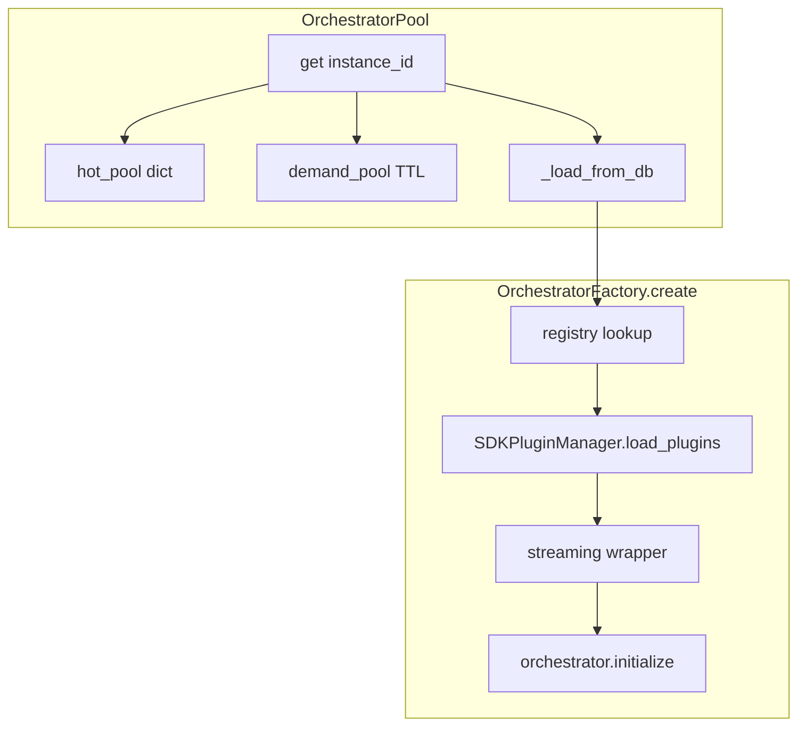
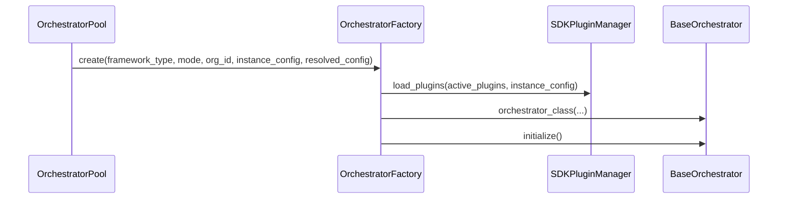
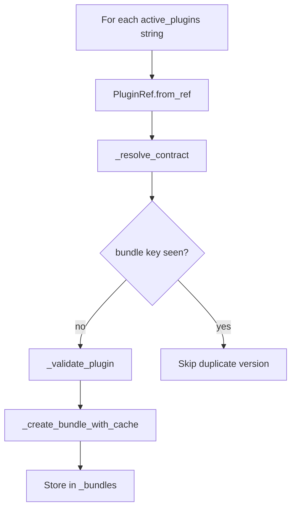
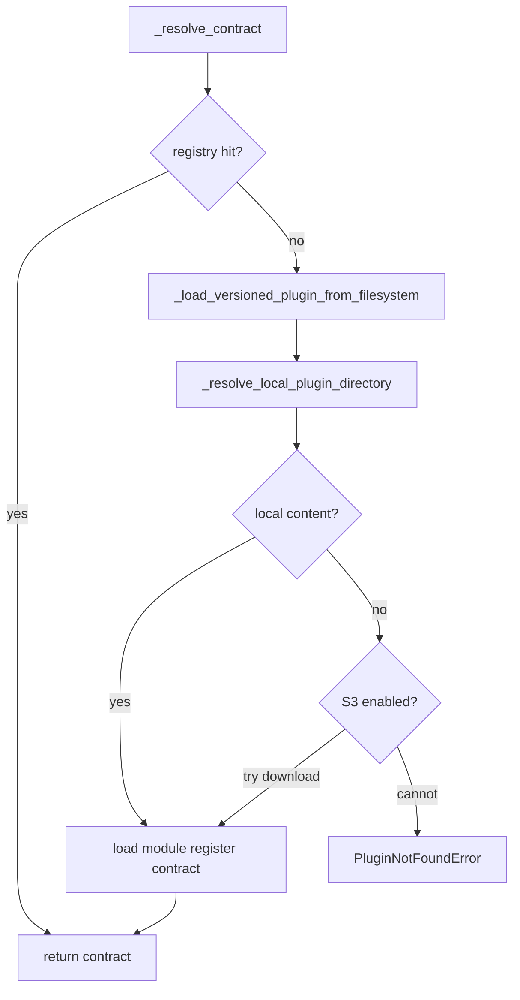
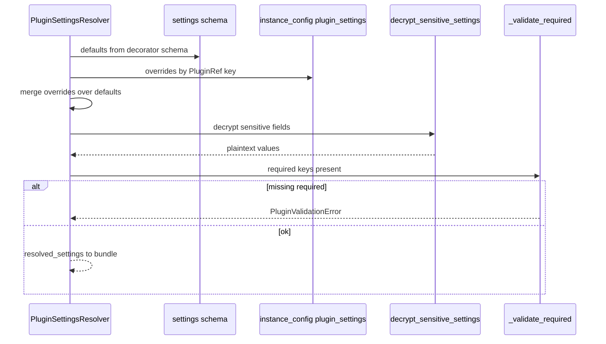

This guide walks through **how an orchestrator instance is obtained at runtime**, how **plugins** are resolved and turned into **`SDKPluginBundle`** objects, and how **per-instance settings** are merged and decrypted. For uploading ZIPs to the catalog, see [Plugin upload and verification](/guides/plugin-upload-pipeline/). For product context, see [Hot reload AI App pool](/features/hot-reload-ai-app-pool/), [AI Agent system](/features/plugin-system/), and [Chat and engine](/features/chat-and-engine/).

## Big picture

On a chat request, the engine resolves an **orchestrator instance id**, then **`OrchestratorPool.get(instance_id)`** returns a **`BaseOrchestrator`**. If the instance is not in the **hot** or **demand** pool, the pool **loads configuration from the database** and **`OrchestratorFactory.create`** builds: **adapter → `SDKPluginManager` → `load_plugins` → streaming wrapper → orchestrator → `initialize()`**.



## Pool — getting an orchestrator

**Why:** Orchestrators are expensive; **hot** instances stay resident; **demand** instances are TTL-evicted and capped.

**What:** `OrchestratorPool.get` in `src/cadence/engine/pool/pool.py`.

### In the code

1. If `instance_id in self.hot_pool` → return immediately.
2. Else `self.demand_pool.get(instance_id)` — on hit, TTL is **extended** (`DemandPool.get` updates `_last_accessed`).
3. Else acquire **`self.locks[instance_id]`**, **double-check** hot and demand, then **`await self._load_from_db(instance_id, source="on_demand")`**.

`DemandPool.peek` returns an instance **without** extending TTL (used when you must inspect without treating access as “use” — e.g. reload paths).

```python
async def get(self, instance_id: str) -> BaseOrchestrator:
    if instance_id in self.hot_pool:
        return self.hot_pool[instance_id]
    orch = self.demand_pool.get(instance_id)
    if orch is not None:
        return orch
    self._ensure_lock(instance_id)
    async with self.locks[instance_id]:
        if instance_id in self.hot_pool:
            return self.hot_pool[instance_id]
        orch = self.demand_pool.get(instance_id)
        if orch is not None:
            return orch
        return await self._load_from_db(instance_id, source="on_demand")
```

## Cold load — DB row to factory

**Why:** Demand-tier misses must hydrate **`framework_type`**, **`mode`**, **`config`**, **`plugin_settings`**, and **`whoami`** from persistence before construction.

**What:** `_load_from_db` loads the instance row, then **`build_resolved_instance_config`** (`src/cadence/engine/config_builder.py`), then **`await self.factory.create(...)`**, then **`self.demand_pool.set(instance_id, orchestrator)`**.

### Config shapes

- **`instance_config`** — `config` merged with **`plugin_settings`** from the row (org overrides for each plugin key).
- **`resolved_config`** — **`instance_config`** plus **`org_id`** and **`whoami`**, passed into the orchestrator stack.

```python
instance_config = {
    **config,
    "plugin_settings": instance.get("plugin_settings", {}),
}
resolved_config = {
    **instance_config,
    "org_id": instance["org_id"],
    "whoami": instance.get("whoami") or "",
}
```

## Factory — wiring

**What:** `OrchestratorFactory.create` in `src/cadence/engine/factory.py`.

**Order:**

1. **`registry[(framework_type, mode)]`** → `BackendRegistryEntry` (adapter, orchestrator, streaming wrapper classes).
2. **`adapter = adapter_class()`**
3. **`SDKPluginManager(...)`** with `llm_factory`, `org_id`, tenant/system plugin roots, **`plugin_store`**, **`bundle_cache`**
4. **`await plugin_manager.load_plugins(plugin_specs, instance_config)`** where `plugin_specs = instance_config.get("active_plugins", [])`
5. **`streaming_wrapper = streaming_wrapper_class()`**
6. **`orchestrator = orchestrator_class(plugin_manager=..., llm_factory=..., resolved_config=..., adapter=..., streaming_wrapper=...)`**
7. **`await orchestrator.initialize()`**



## Plugin loading loop

**What:** `SDKPluginManager.load_plugins` in `src/cadence/infra/plugins/plugin_manager.py`.

For each string in **`active_plugins`** (e.g. `org:com.example.plugin@1.0.0`):

1. **`PluginRef.from_ref(plugin_spec)`**
2. **`contract = await self._resolve_contract(plugin_ref, registry)`**
3. Deduplicate by **`(source, pid, contract.version)`**
4. **`self._validate_plugin(contract)`** (SDK structure validation)
5. **`bundle = await self._create_bundle_with_cache(contract, settings_resolver, plugin_ref)`**
6. Store in **`self._bundles`**

`PluginSettingsResolver(instance_config)` is constructed once per load and passed into bundle creation.



## Contract resolution — registry, filesystem, S3 sync

**What:** `PluginLoaderMixin._resolve_contract` in `src/cadence/infra/plugins/plugin_loader.py`.

1. **`registry.get_plugin_by_version(pid, version)`** — in-process SDK registry (e.g. already loaded in this worker).
2. If missing → **`await _load_versioned_plugin_from_filesystem(plugin_ref)`** which uses **`_resolve_local_plugin_directory`** → **`_find_plugin_file`** → **`_ensure_plugin_dependencies`** → **`_load_plugin_module`** (runs **`scan_plugin_ast`** before `exec_module`) → **`_extract_plugin_class`** → **`PluginContract` + register in registry**.
3. If still missing → **`PluginNotFoundError`**.
4. If **`plugin_store`** exists and S3 is enabled → **`ensure_local(pid, version, org_id)`** to align local cache with object storage; on **`ResourceNotFoundError`**, logs a **warning** and continues with local-only content.

### Local directory resolution

**`_resolve_local_plugin_directory`** tries, in order:

1. **`plugin_store.ensure_local(...)`** if a store is configured (may download and extract from S3).
2. Else **tenant** path `tenant_plugins_root / org_id / pid / version` or **system** path `system_plugins_dir / pid / version` if directories exist and are non-empty.

## Cache miss — `ensure_local`

**What:** `PluginStoreRepository.ensure_local` in `src/cadence/data/plugins/store.py`.

- If local dir exists with content → **cache hit**.
- If S3 disabled and missing locally → **`PluginNotFoundError`** (when that path is used as the only source).
- If S3 enabled → download **`s3_key`**, **`_extract_zip`** into the local cache path.

## Plugin not found — decision outline



## Settings injection

**What:** `PluginSettingsResolver.resolve` in `src/cadence/infra/plugins/plugin_settings_resolver.py`.

**Order:**

1. Schema from **`get_plugin_settings_schema(plugin_class)`** → defaults.
2. Overrides from **`instance_config["plugin_settings"][plugin_ref.to_ref()]`** — keys like **`org:pid@version`**.
3. Merge **`{**defaults, **overrides}`**.
4. **`decrypt_sensitive_settings(resolved, settings_schema)`**.
5. **`_validate_required`** — **`PluginValidationError`** if a required key is missing.

Lookup uses **`PluginRef.to_ref()`** so instance rows and API payloads stay aligned with **`active_plugins`** strings.



## Bundle creation and optional shared cache

**What:** `PluginBundleBuilderMixin` in `src/cadence/infra/plugins/plugin_bundle_builder.py`.

**`_create_bundle`** (simplified order in source):

1. **`metadata = contract.plugin_class.get_metadata()`**
2. **`agent = contract.plugin_class.create_agent()`**
3. **`resolved_settings = settings_resolver.resolve(...)`**
4. **`agent.initialize(resolved_settings)`** when supported
5. **`uv_tools = agent.get_tools()`** → **`orchestrator_tools`** via adapter
6. **`_create_plugin_model`** when **`llm_config_id`** (etc.) appears in resolved settings
7. LangGraph: **`create_tool_node(uv_tools)`** when **`adapter.framework_type == "langgraph"`**
8. Return **`SDKPluginBundle`**

**`_create_bundle_with_cache`:** If **`bundle_cache`** is set and **`contract.is_stateless`**, **`SharedBundleCache.get_or_create`** keys bundles by **`(plugin_pid, version, settings_hash, adapter_type)`** where **`settings_hash`** is the first 16 hex chars of SHA-256 of sorted JSON settings (`src/cadence/engine/shared_resources/bundle_cache.py`). Otherwise builds a fresh bundle every time.

Stateful plugins skip sharing so agent state does not leak across instances.

## Example `instance_config` slice

```python
{
  "active_plugins": ["org:com.acme.helpdesk@1.0.0"],
  "plugin_settings": {
    "org:com.acme.helpdesk@1.0.0": {
      "settings": [
        {"key": "api_key", "value": "enc:..."},
        {"key": "max_results", "value": 25},
      ]
    }
  }
}
```

`load_plugins` walks **`active_plugins`**, resolves each **`PluginRef`**, merges settings for that ref, and attaches bundles to the **`SDKPluginManager`** used when the orchestrator graph calls into plugin tools.

## Behavior summary

| Scenario                            | What happens                                                   |
| ----------------------------------- | -------------------------------------------------------------- |
| Plugin already in SDK registry      | `_resolve_contract` returns without filesystem I/O             |
| Not in registry, local tree present | Loaded from disk, registered, `ensure_local` may still sync S3 |
| Local empty, S3 on                  | `ensure_local` downloads zip and extracts                      |
| Local empty, S3 off                 | Resolution fails with `PluginNotFoundError` when no path works |
| S3 object missing but files local   | Warning logged; local copy used                                |
| Stateless + cache + same settings   | `SharedBundleCache` may reuse bundle                           |
| Stateful plugin                     | Always fresh bundle path (no cross-instance sharing)           |
| Missing required setting            | `PluginValidationError` during `resolve`                       |

## Key modules

| Concern                    | File                                                                                                |
| -------------------------- | --------------------------------------------------------------------------------------------------- |
| Hot / demand / DB load     | `src/cadence/engine/pool/pool.py`, `src/cadence/engine/pool/demand_pool.py`                         |
| Instance config merge      | `src/cadence/engine/config_builder.py`                                                              |
| Factory pipeline           | `src/cadence/engine/factory.py`                                                                     |
| Plugin manager + bundles   | `src/cadence/infra/plugins/plugin_manager.py`, `src/cadence/infra/plugins/plugin_bundle_builder.py` |
| Filesystem + registry load | `src/cadence/infra/plugins/plugin_loader.py`                                                        |
| Settings merge + decrypt   | `src/cadence/infra/plugins/plugin_settings_resolver.py`                                             |
| Stateless bundle cache     | `src/cadence/engine/shared_resources/bundle_cache.py`                                               |
| Local / S3 paths           | `src/cadence/data/plugins/store.py`                                                                 |

## Related documentation

- [Plugin upload and verification](/guides/plugin-upload-pipeline/) — ZIP validation path (subprocess inspector, etc.).
- [Developer onboarding](/guides/developer-onboarding/) — engine and `infra` layout.
- [Hot reload AI App pool](/features/hot-reload-ai-app-pool/) — when reload picks up new plugins.
- [AI Agent system](/features/plugin-system/) — product lifecycle.
