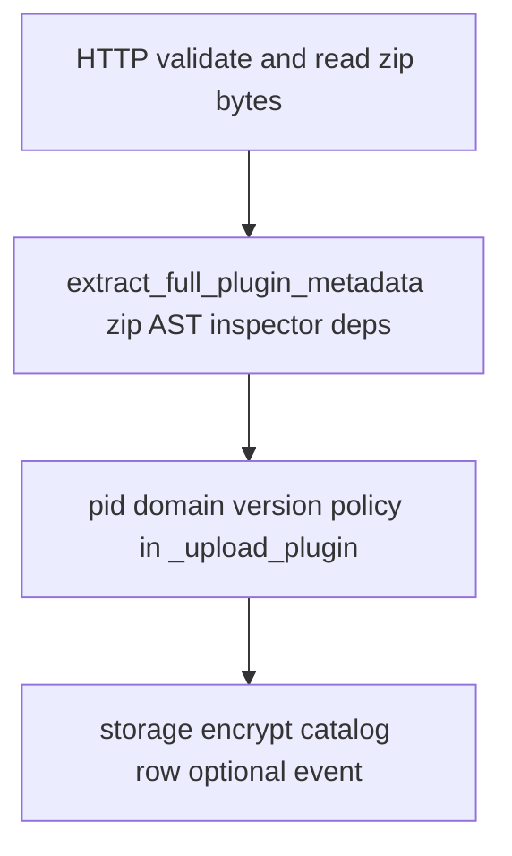
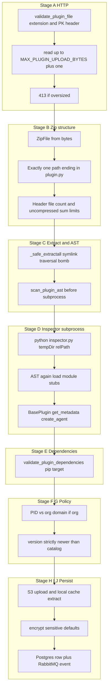
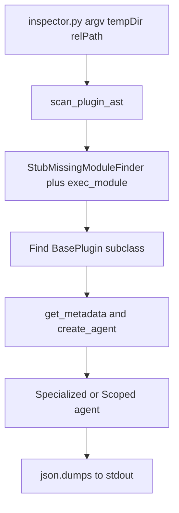

This guide describes **how a plugin ZIP is validated and stored** in the Cadence Python service: exact **call order**, **why** each stage exists, and **where** to read the code. For product behavior and APIs, see [AI Agent system](/features/plugin-system/). For SDK authoring, see [Plugin SDK](/features/plugin-sdk/) and [Plugins catalog](/features/plugins-catalog/).

## HTTP entry points

Two upload routes share the same domain pipeline after bytes are read:

| Route                                    | Handler                                                              | Role                                                                                                                                   |
| ---------------------------------------- | -------------------------------------------------------------------- | -------------------------------------------------------------------------------------------------------------------------------------- |
| `POST /api/orgs/{org_id}/plugins/upload` | `upload_organization_plugin` in `src/cadence/api/plugins/plugin.py`  | Org-scoped plugin; passes `org_id`, `zip_bytes`, and `org_domain` from the org record into `PluginService.upload_organization_plugin`. |
| `POST /api/admin/plugins/upload`         | `upload_system_plugin` in `src/cadence/api/plugins/system_plugin.py` | System catalog; calls `PluginService.upload_system_plugin` with **no** `org_id` or `org_domain`.                                       |

**In the code:** both handlers first call `read_validated_plugin_file(file)` from `src/cadence/api/common/helpers.py`, then `request.app.state.plugin_service.upload_*` with the returned `zip_bytes`.

## Happy-path call chain

Narrative order (matches runtime):

1. **`read_validated_plugin_file`** — validates `.zip` + magic bytes + max size, returns `bytes`.
2. **`PluginService.upload_organization_plugin`** or **`upload_system_plugin`** → **`_upload_plugin`** (`src/cadence/domain/plugins/service.py`).
3. **`extract_full_plugin_metadata(zip_bytes)`** (`src/cadence/domain/plugins/plugin_inspection.py`):
   - **`_validate_zip_structure`** — single `plugin.py`, zip metadata limits.
   - **`_run_plugin_inspector`** — `_safe_extractall`, **`scan_plugin_ast`** on disk, **`subprocess.run`** on `inspector.py`, **`json.loads`** stdout.
   - **`validate_plugin_dependencies`** — PEP 508 + `pip install --target`.
4. Back in **`_upload_plugin`**: if **`org_domain`** is set, **`validate_plugin_id_matches_domain`**; load existing versions; **`validate_version_strictly_newer`**.
5. **`_upload_plugin_to_storage`** — `plugin_store.upload` (S3 + local extract) and logical `s3_path` string for the DB row.
6. **`encrypt_sensitive_settings`** on default settings using `settings_schema`.
7. **`system_plugin_repo.upload`** or **`organization_plugin_repo.upload`**.
8. **`event_publisher.publish_plugin_uploaded`** when the broker is configured.

```mermaid
flowchart LR
  subgraph httpLayer [HTTP]
    R[read_validated_plugin_file]
  end
  subgraph domainMeta [Metadata extraction]
    V[_validate_zip_structure]
    P[_run_plugin_inspector]
    D[validate_plugin_dependencies]
  end
  subgraph policy [Policy in _upload_plugin]
    PID[validate_plugin_id_matches_domain]
    VER[validate_version_strictly_newer]
  end
  subgraph persist [Persist]
    ST[_upload_plugin_to_storage]
    ENC[encrypt_sensitive_settings]
    DB[repo.upload]
    EV[publish_plugin_uploaded]
  end
  R --> E[extract_full_plugin_metadata]
  E --> V
  V --> P
  P --> D
  D --> PID
  PID --> VER
  VER --> ST
  ST --> ENC
  ENC --> DB
  DB --> EV
```



Condensed phases (same path as above):



## End-to-end pipeline diagram

Stages below are numbered for cross-reference; subprocess inspection is expanded in [Inspector subprocess](#inspector-subprocess-isolation).



## Stage A — HTTP file guard

**Why:** Reject obviously bad input before allocating heavy work (zip parsing, extract, subprocess).

**What:** `read_validated_plugin_file` calls `validate_plugin_file` then reads bytes with a hard cap.

**Failure:** `HTTPException` **400** (wrong extension, bad ZIP magic) or **413** (body larger than `MAX_PLUGIN_UPLOAD_BYTES`). Constants: `src/cadence/core/constants/app.py` (`MAX_PLUGIN_UPLOAD_BYTES` is 5 MiB); message in helpers references “5 MB”.

### In the code

`validate_plugin_file` (`src/cadence/api/common/validators.py`) requires `.zip` filename and `PK\x03\x04` header. `read_validated_plugin_file` reads `MAX_PLUGIN_UPLOAD_BYTES + 1` bytes and rejects if length exceeds the limit.

```python
async def read_validated_plugin_file(file: UploadFile) -> bytes:
    await validate_plugin_file(file)
    zip_bytes = await file.read(MAX_PLUGIN_UPLOAD_BYTES + 1)
    if len(zip_bytes) > MAX_PLUGIN_UPLOAD_BYTES:
        raise HTTPException(
            status_code=status.HTTP_413_REQUEST_ENTITY_TOO_LARGE,
            detail="Plugin file exceeds maximum allowed size (5 MB)",
        )
    return zip_bytes
```

## Stage B — ZIP structure and header limits

**Why:** Ensure the archive is a real zip, contains **exactly one** `plugin.py`, and passes **header-level** anti-abuse limits before full extraction.

**What:** `_validate_zip_structure` in `src/cadence/domain/plugins/plugin_inspection.py`.

**Failure:** `PluginValidationError` (invalid zip, zero or multiple `plugin.py`, too many entries, uncompressed total over cap). These propagate as **`CadenceException`** responses via `ErrorHandlerMiddleware` (not the route’s `ValueError` branch).

### In the code

- `BadZipFile` → validation error.
- `plugin_file_paths` from `namelist()` ending with `plugin.py` — must be length 1.
- `infolist()` length vs `MAX_ZIP_FILES` (500).
- Sum of `file_size` vs `MAX_ZIP_UNCOMPRESSED_BYTES` (10 MiB) from `src/cadence/domain/plugins/zip_limits.py`.

## Stage C — Safe extraction and streaming zip-bomb guard

**Why:** Even with header checks, extraction must not write outside the temp directory, must not follow zip symlinks, and must bound **actual** decompressed bytes.

**What:** `_safe_extractall` in `zip_limits.py`, invoked from `_run_plugin_inspector` before and during inspection.

**Failure:** `PluginValidationError` for symlink, path traversal, or decompressed byte overflow.

### In the code

```python
def _safe_extractall(zf: zipfile.ZipFile, dest: Path) -> None:
    dest_resolved = dest.resolve()
    total_bytes = 0
    for entry in zf.infolist():
        unix_mode = entry.external_attr >> 16
        if unix_mode and (unix_mode & 0o170000) == 0o120000:
            raise PluginValidationError(...)
        entry_path = (dest / entry.filename).resolve()
        if not str(entry_path).startswith(str(dest_resolved)):
            raise PluginValidationError(...)
        # ... open entry, read chunks ...
        total_bytes += len(chunk)
        if total_bytes > MAX_ZIP_UNCOMPRESSED_BYTES:
            raise PluginValidationError(...)
```

## Stage D — AST scan before subprocess

**Why:** Block dangerous imports and dynamic execution **before** executing `plugin.py` in the parent process’s extract step (defense in depth; inspector runs the same scan again inside the child).

**What:** `scan_plugin_ast` in `src/cadence/domain/plugins/ast_scan.py`.

**Failure:** `PluginValidationError` with messages like “Plugin imports blocked module …” or “Plugin uses blocked builtin …”.

### In the code

Blocked top-level imports and names are explicit sets:

```python
_BLOCKED_IMPORTS = {
    "os", "subprocess", "socket", "ctypes", "importlib",
    "pty", "shutil", "pathlib", "tempfile", "signal",
    "multiprocessing", "threading", "asyncio",
}
_BLOCKED_NAMES = {"__import__", "__builtins__", "eval", "exec", "compile"}
```

## Inspector subprocess isolation

**Why:** Loading `plugin.py` runs **module-level code**. Running inspection in a **separate interpreter process** keeps failures and import side effects out of the API worker. Missing third-party packages are **stubbed** so metadata extraction can still run.

**What:** `_run_plugin_inspector` runs:

`[sys.executable, path/to/inspector.py, temp_directory_path, plugin_file_path]`

with `PLUGIN_INSPECTION_TIMEOUT_SEC` (10 minutes). Stdout must be JSON; non-zero exit → `PluginValidationError`.

### In the code

`src/cadence/domain/plugins/plugin_inspection.py`:

```python
result = subprocess.run(
    [
        sys.executable,
        str(_INSPECTOR_SCRIPT_PATH),
        str(temp_directory_path),
        plugin_file_path,
    ],
    capture_output=True,
    text=True,
    timeout=PLUGIN_INSPECTION_TIMEOUT_SEC,
)
```

Inside `src/cadence/domain/plugins/inspector.py`, `_inspect_plugin`:

1. **`scan_plugin_ast`** again on the plugin file.
2. **`StubMissingModuleFinder`** on `sys.meta_path`, then **`exec_module`**.
3. Find a concrete **`BasePlugin`** subclass.
4. **`get_metadata()`**, schema/logo helpers, **`create_agent()`** (must not raise).
5. Agent instance must be **`BaseSpecializedAgent`** or **`BaseScopedAgent`**.
6. **`print(json.dumps(result))`** on success.



## Stage E — Dependency validation

**Why:** Ensure declared pip dependencies are **PEP 508**–valid, **installable** with wheels only, and not a vector for **flag injection** or arbitrary URLs.

**What:** `validate_plugin_dependencies` in `src/cadence/domain/plugins/plugin_dependencies.py`, called from `extract_full_plugin_metadata` **after** inspector JSON is parsed (dependencies list comes from plugin metadata).

**Failure:** Too many deps, invalid spec, `pip` failure or timeout (120s).

### In the code

- Max **`MAX_PLUGIN_DEPS`** (20).
- Reject strings starting with `-`, `http://`, or `https://`.
- `pip install --target=<tmpdir> --only-binary=:all: --quiet` + dependency list.

## Stage F — Plugin ID vs organization domain (org uploads only)

**Why:** Org plugins must use **reverse-domain** `pid` prefixes derived from the org’s domain to reduce cross-tenant spoofing.

**What:** `validate_plugin_id_matches_domain` in `src/cadence/domain/plugins/serialization.py`. Called from `_upload_plugin` **only when `org_domain` is truthy** — system uploads pass `org_domain=None` and **skip** this check.

**Failure:** `PluginValidationError` describing expected prefix.

## Stage G — Version must be strictly newer

**Why:** Prevent silently “downgrading” or reusing an existing version string in the same catalog slice.

**What:** `validate_version_strictly_newer` in `src/cadence/domain/plugins/lookup_helpers.py` after listing existing versions for that `pid` (system or org repo).

**Failure:** `PluginValidationError` if the new version is `<=` the highest existing PEP 440 version.

## Stage H — Encrypt sensitive default settings

**Why:** Default settings may include secrets; fields marked **`sensitive`** in the schema are encrypted at rest.

**What:** `encrypt_sensitive_settings` from `src/cadence/infra/security/encryption.py`, invoked in `_upload_plugin` after metadata is known and before DB insert.

## Stage I — Storage: S3 and local cache

**Why:** Object storage is the **durable** artifact; local disk is a **cache** for fast runtime loading.

**What:** `PluginStoreRepository.upload` in `src/cadence/data/plugins/store.py`. `_upload_plugin_to_storage` in `PluginService` also sets a logical **`s3_path`** string on the row (`plugins/system/...` or `plugins/tenants/...`) aligned with `s3_key` layout (`system/{pid}/{version}/plugin.zip` vs `tenants/{org_id}/{pid}/{version}/plugin.zip`).

**Runtime:** `ensure_local` prefers cache; downloads from S3 on miss when enabled.

## Stage J — Catalog row and event

**Why:** Persist authoritative metadata for API discovery and orchestrator attachment; notify other nodes via messaging.

**What:** `system_plugin_repo.upload` vs `organization_plugin_repo.upload` with merged kwargs; then `event_publisher.publish_plugin_uploaded` when configured.

**Row fields** (conceptually): `pid`, `version`, `name`, `description`, `tag`, `s3_path`, `logo_image`, `default_settings`, `settings_schema`, `capabilities`, `is_specialized`, `is_scoped`, `stateless`, `is_latest`, `enabled`, etc., as defined by repositories and models.

## Route-level errors vs domain exceptions

- **HTTP layer:** `HTTPException` **400** / **413** from `read_validated_plugin_file` / `validate_plugin_file`.
- **Domain:** Most failures are **`PluginValidationError`** (`src/cadence/core/exceptions/plugin.py`), a **`CadenceException`** handled by **`ErrorHandlerMiddleware`** with structured JSON (see `src/cadence/core/middleware/error_handler.py`). Upload routes also catch **`ValueError`** for **400** in some handlers; **`PluginValidationError`** is **not** a `ValueError`, so it flows to the middleware.

When documenting support tickets, use **`details.validation_errors`** from the flat error payload when present.

## Security summary

| Check                                     | What it blocks                     | Primary module                                   |
| ----------------------------------------- | ---------------------------------- | ------------------------------------------------ |
| Max upload bytes                          | Huge HTTP bodies                   | `api/common/helpers.py`, `core/constants/app.py` |
| ZIP magic / extension                     | Non-zip uploads                    | `api/common/validators.py`                       |
| Valid zip + single `plugin.py`            | Corrupt or ambiguous archives      | `domain/plugins/plugin_inspection.py`            |
| Max zip entries / header size             | Zip bombs (metadata)               | `plugin_inspection.py`, `zip_limits.py`          |
| Symlink / traversal / byte cap on extract | Escape / zip bombs (data path)     | `domain/plugins/zip_limits.py`                   |
| AST blocked imports / names               | Dangerous APIs in source           | `domain/plugins/ast_scan.py`                     |
| Subprocess inspector                      | Untrusted execution in API process | `plugin_inspection.py`, `inspector.py`           |
| BasePlugin + agent class rules            | Invalid or unsafe agent types      | `inspector.py`                                   |
| Dep count / no flags or URLs / pip        | Supply chain and sprawl            | `domain/plugins/plugin_dependencies.py`          |
| Reverse-domain pid (org)                  | Cross-tenant pid spoofing          | `domain/plugins/serialization.py`                |
| Strictly newer version                    | Version regression / overwrite     | `domain/plugins/lookup_helpers.py`               |
| Encrypt sensitive defaults                | Secrets in DB                      | `infra/security/encryption.py`                   |
| S3 + local cache                          | Durability vs performance          | `data/plugins/store.py`                          |

## Stage index (quick lookup)

| Step                  | Primary symbols                                                                    | File                                                |
| --------------------- | ---------------------------------------------------------------------------------- | --------------------------------------------------- |
| HTTP validate + read  | `validate_plugin_file`, `read_validated_plugin_file`                               | `api/common/validators.py`, `api/common/helpers.py` |
| Metadata pipeline     | `extract_full_plugin_metadata`, `_validate_zip_structure`, `_run_plugin_inspector` | `domain/plugins/plugin_inspection.py`               |
| Safe extract          | `_safe_extractall`, `MAX_ZIP_*`                                                    | `domain/plugins/zip_limits.py`                      |
| AST                   | `scan_plugin_ast`                                                                  | `domain/plugins/ast_scan.py`                        |
| Inspector             | `_inspect_plugin`, `main`                                                          | `domain/plugins/inspector.py`                       |
| Dependencies          | `validate_plugin_dependencies`                                                     | `domain/plugins/plugin_dependencies.py`             |
| Domain + version      | `validate_plugin_id_matches_domain`, `validate_version_strictly_newer`             | `serialization.py`, `lookup_helpers.py`             |
| Service orchestration | `_upload_plugin`, `_upload_plugin_to_storage`                                      | `domain/plugins/service.py`                         |
| Storage               | `PluginStoreRepository.upload`, `ensure_local`                                     | `data/plugins/store.py`                             |

## Related documentation

- [AI Agent system](/features/plugin-system/) — product lifecycle, APIs, troubleshooting.
- [Orchestrator load, plugins, and settings](/guides/orchestrator-load-and-plugin-settings/) — runtime pool and `SDKPluginManager` after the ZIP is in catalog storage.
- [Plugin SDK](/features/plugin-sdk/) — `BasePlugin`, metadata, agents.
- [Developer onboarding](/guides/developer-onboarding/) — repository layout and plugin-adjacent domains.
