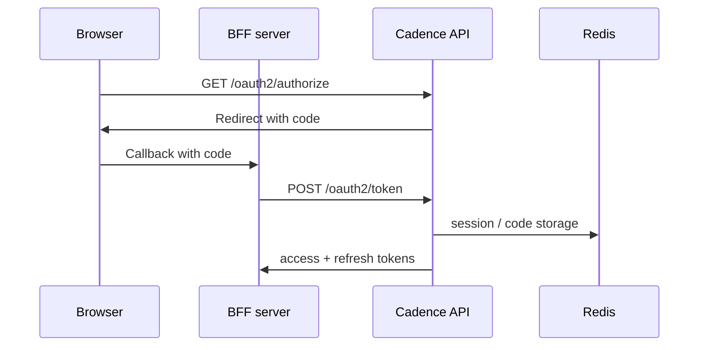

import { Aside, CardGrid, LinkCard, Steps } from '@astrojs/starlight/components';

**OAuth2** is how browsers and mobile apps **sign users in** and obtain **access** and **refresh** tokens; a **BFF** (backend-for-frontend) keeps secrets off the device and forwards Bearer tokens to Cadence. Test plans should cover redirect URLs, consent, and token expiry; implementation detail lives in the OAuth2 token endpoint and authorization server grant logic.

## Summary for stakeholders

- **UX versus security** — Users expect SSO-style flows; the BFF pattern avoids putting client secrets in the browser bundle.
- **Compliance** — Token lifetimes and consent screens are part of your audit story for interactive access.

## Business analysis

- **Flows** — Document redirect chains, consent screens, and error pages for each OAuth grant you enable.
- **Environments** — Separate OAuth client registrations per environment so staging callbacks never hit production URLs.

## Architecture and integration

- Cadence exposes **`/oauth2/*`** and related routes (see `cadence.api.oauth2`); the BFF exchanges codes and stores refresh tokens server-side.
- **Redis** still backs interactive **Bearer** sessions after token exchange (`jti` rows), consistent with [JWT sessions](/features/jwt-sessions/).

## Why this exists

Interactive clients need **standard** login and token exchange without embedding long-lived secrets in JavaScript. Cadence implements OAuth2-style endpoints so your SPA or mobile app can use **authorization code + PKCE** (or password/refresh grants where appropriate) while the API continues to authorize requests with **Bearer** JWTs backed by **Redis** sessions.

## How it fits the platform

Cadence exposes OAuth2-style endpoints under **`/oauth2/*`** and OIDC discovery at **`/.well-known/openid-configuration`**. **`POST /oauth2/token`** switches on **`grant_type`** and calls the matching **`handle_*_grant`** helper.

## Supported grants (`POST /oauth2/token`)

| `grant_type`         | Purpose                                                                                                                                             |
| -------------------- | --------------------------------------------------------------------------------------------------------------------------------------------------- |
| `password`           | Resource-owner password (validated via `AuthService` / user repo); requires OAuth2 client credentials when clients are registered.                  |
| `refresh_token`      | Rotates access + refresh via `AuthService.refresh` (see [JWT sessions](/features/jwt-sessions/)).                                                   |
| `authorization_code` | Exchanges a one-time code from the consent redirect for tokens; uses **`session_store.consume_oauth2_code`** and optional PKCE **`code_verifier`**. |

Unknown grants return **400** `unsupported_grant_type`.

## Authorization code flow (browser-friendly)

<Steps>

    1. Client redirects user to **`GET /oauth2/authorize`** with `client_id`, `redirect_uri`, `scope`, `state`, optional
    PKCE `code_challenge`.
    2. After login/consent, user is redirected back with a **`code`** (stored briefly in Redis via
    **`store_oauth2_code`**).
    3. **BFF or confidential client** calls **`POST /oauth2/token`** with `grant_type=authorization_code`, `code`,
    `redirect_uri`, `client_id`/`client_secret`, and **`code_verifier`** if PKCE was used.

</Steps>

Related routes: **`/oauth2/consent/*`**, **`/oauth2/userinfo`**, **`POST /oauth2/revoke`**, **`POST /oauth2/introspect`** — see the [Security and access](/concepts/security-and-access/) API table.

## Key properties

| Topic     | Rule                                                                                                                                                             |
| --------- | ---------------------------------------------------------------------------------------------------------------------------------------------------------------- |
| Secrets   | Never ship **`client_secret`** in a browser bundle — exchange codes on a **server-side** BFF or use **public** clients with PKCE only when your model allows it. |
| Transport | Cadence expects **Bearer** access tokens on API calls; a BFF often stores **refresh** in **http-only** cookies and attaches **access** to upstream requests.     |
| CORS      | Set **`CADENCE_CORS_ORIGINS`** for browser origins calling the API directly (see application entry and CORS configuration).                                      |

## What this is not

<Aside type="note" title="Org selection vs login">
  Choosing an **active organization** in a client (often **`X-ORG-ID`**) is separate from the
  **OAuth login** flow. Register **redirect URIs** and **clients** in the database so they match
  what your front end uses.
</Aside>

## Limitations

- Grant support is **fixed** to the three types above; extension grants return **400**.
- Token and consent behavior depends on **Redis** for sessions and OAuth artifacts; broker/DB issues surface as **401**/**invalid_grant** style errors from domain services.

## Next steps

<CardGrid>
  <LinkCard
    title="Security and access"
    href="/concepts/security-and-access/"
    description="JWT, API keys, sessions, and OAuth-related endpoints."
  />
  <LinkCard
    title="JWT sessions"
    href="/features/jwt-sessions/"
    description="Redis-backed jti sessions, revocation, and refresh."
  />
  <LinkCard
    title="OAuth2 clients"
    href="/guides/oauth2-clients/"
    description="Registering and managing OAuth2 clients in the deployment."
  />
</CardGrid>
